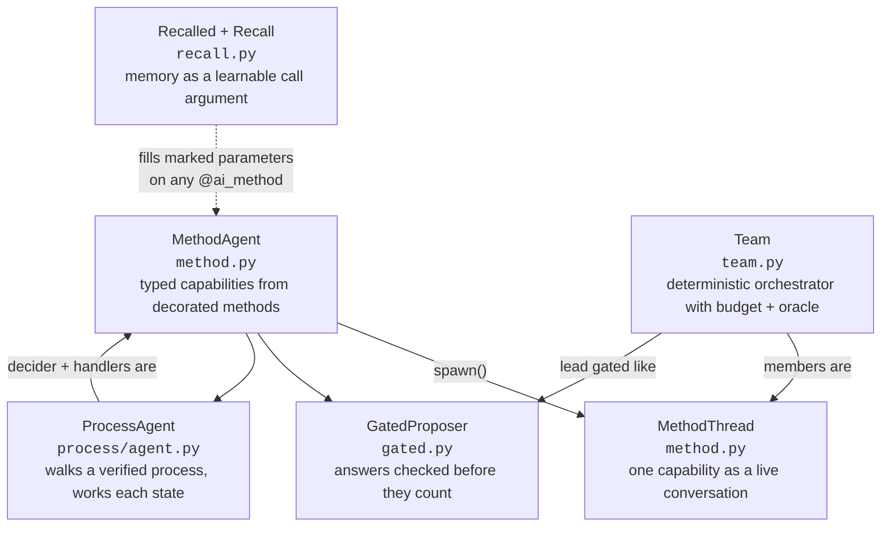
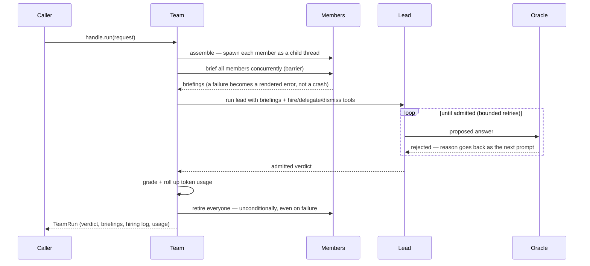
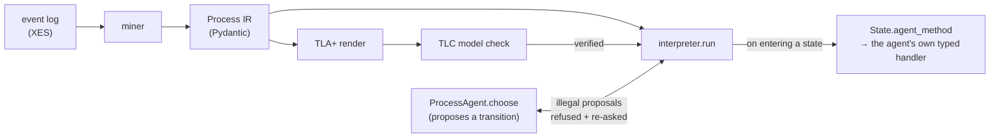

# pneuma

Build AI agents as ordinary Python classes. Each thing an agent can do is a method: the
docstring is the prompt, the parameters are the blanks a caller fills in per call, and the type
hints tell other agents exactly how to call it — so one agent hands another its abilities as
properly typed tools, not as a chat box.

Around that sits a second idea: **a check that passes without ever being in a position to fail
is not a passing check.** A rule no reachable state can break cannot tell a compliant run from a
violation; a scoring term whose value never moves cannot tell a good answer from a bad one.
`src/pneuma/detect/` reduces both to one primitive with a three-valued verdict, and the rest of
the repo is organised around making that defect class mechanically detectable — including in
its own machinery.

Built on [`strands-ai-functions`](https://github.com/strands-labs/ai-functions), pinned to
upstream commit `e47dc94`. uv + Python 3.14, `global.anthropic.claude-opus-5` on Bedrock.
Test suite: **738 passed, 10 skipped** (748 collected), fully offline against scripted models.

## The kernel

Five classes, each making one silent failure mode unrepresentable. They stack: a `Team`'s
members are live `MethodThread`s joining the lead as typed tools, the lead's answer is gated
the `GatedProposer` way, any of them can pull declared memory through `Recall`, and a
`ProcessAgent` can be the one walking a verified flowchart underneath.



| Piece | Module · lines | What it does |
| --- | --- | --- |
| `MethodThread` | `method.py` · 428 | Keeps one ability running as a live conversation. Call it twice and the second call remembers the first. Pause it, branch it into a copy, or shut it down cleanly — shutdown is safe even if something else already killed the thread. |
| `GatedProposer` | `gated.py` · 414 | An agent whose answers are checked before they count. A rejected answer goes straight back to the model with the reason, and it tries again. A bug in the checker is reported as a bug, never disguised as a rejection. |
| `Recalled` + `Recall` | `recall.py` · 409 | Lets a method declare, on its signature, "this parameter comes from memory." The library fetches it fresh on every call and passes it in as a normal argument — which is what lets the training loop see it and improve what's stored. |
| `ProcessAgent` | `process/agent.py` · 396 | An agent tied to a verified flowchart. It proposes the next step (illegal proposals are refused and re-asked) and does the work inside each step it enters. One object walks the process and works it. |
| `Team` | `team.py` · 968 | Runs a group: spin up the members, brief them all, run a lead that can hire helpers up to a budget, check the final answer against an oracle, and clean everything up no matter what — even when a step fails. |

### The design rule underneath

`self` is where each agent instance keeps its private context — its evidence, its process, its
settings. The docstring prompt reads it directly (`{self.evidence}`), and answer-checkers can
use it too. It just isn't part of the call: callers never fill it in, and the training
machinery never rewrites it. Anything supplied per call or improved by training comes in
through the parameters. Private context on `self`, per-call inputs as parameters — the whole
kernel is built around that split.

```python
class Analyst(MethodAgent):
    def __init__(self, plane: str):
        self.evidence = load(plane)   # this agent's private context

    @ai_method(Finding, description="Analyze one plane over a window")
    def analyze(
        self,
        advice: Annotated[list[str], Recalled("guidance", k=2)],  # from memory, fresh per call
        window: str,                                              # a plain per-call input
    ) -> Finding:
        """Guidance for this decision: {advice}

        My evidence: {self.evidence}
        Analyze the window {window}."""
```

### How a Team run flows



### How a ProcessAgent walks a verified process

The process is mined from a real event log into a typed IR, model-checked with TLA+/TLC, and
only then executed. The agent is an untrusted proposer: it may only take transitions the
verified skeleton permits.



## What this adds over the library

Verified against the vendored library source, not inferred.

**No library analogue at all.**

1. **Objective probing** (`detect/objective.py`). The library ships `TextGradOptimizer` and
   `GradFeedback(text, score)` and gives you no way to inspect the objective those climb.
   Ours sweeps, refines, and refuses before a training loop runs, over four failure modes:
   a degenerate input is the optimum, feedback states a different quantity than selection
   uses, the objective raises inside its declared domain, and the optimum sits on the swept
   window's own edge. Pure stdlib.
2. **Rule-vacuity detection** (`detect/vacuity.py` + `adapter.py`). A model-checker answers
   "did any reachable state break this rule", never "was the rule ever in a position to
   break". A reachability sweep plus four relaxations answers the second, and the level at
   which a rule first becomes breakable is its diagnosis.
3. **The discrimination primitive** (`detect/discrimination.py`, pure stdlib). The shared
   shape of 1 and 2: a three-valued verdict plus named `withheld` reasons, so every bound
   applied is visible in the result it produced.
4. **Adversarial search over an objective** (`detect/adversary.py`). LLM adversaries given a
   tool that *calls* the objective and its source, searching for an input that scores well
   and is worthless. Enumeration only finds what the declared structure implies.
5. **A verified-IR execution model** (`process/`). One `Process` IR, three consumers: a TLA+
   renderer TLC checks, a hand-written interpreter, and a Hypothesis machine that drives the
   real interpreter and shrinks failing traces. The model emits data, never code.
6. **`@ai_method` on bound methods** (`method.py`) — and the four kernel classes built on it
   (`gated.py`, `recall.py`, `process/agent.py`, `team.py`). The library is decorator-first
   on module-level functions; a bound method recovers the typed schema, the
   docstring-as-prompt, and learnable parameters at once.
7. **Budgeted self-staffing** (`team.py`'s hiring seam; demo binding in `demo/staffing.py`).
   The library injects `list_threads`/`send_message` into every thread so an agent can talk
   to peers that exist, and ships no way to create one. `hire`/`delegate`/`dismiss` are bound
   to the live cycle context so the hiring agent is recorded as parent — which is what makes
   the library's token rollup work across a tree the agent built itself. Hardened against
   the concurrent tool executor: the hiring cap reserves before it awaits.

**Hardening something the library does provide.**

8. **The memory backend** (`memory/turso_backend.py`). Retrieval is Cohere Embed v4 vectors
   with in-database `vector_distance_cos` where both shipped backends use BM25; numeric
   parameters are learned from `GradFeedback.score` via a trust-region search over the
   schema-declared domain; and retrieval quality is *measured* (`probe_retrieval`,
   `calibrate_ceiling`), which has no library analogue.

## Library / application boundary

`LIBRARY = {detect, gated, memory, method, model, process, recall, team}` and
`APPLICATION = {casestudy, demo}`, enforced by `tests/library/test_boundary.py` at the AST
level (function-body imports included) plus a subprocess import blocker that catches transitive
reaches. No library module can import the application or `polars`/`libsql`/`pm4py`, ever.
During every kernel refactor, the application's test files were kept frozen as regression
oracles — the proof that the generalization changed nothing observable.

## The two fixtures, as evidence

**A curated business-process log.** `data/receipt.xes`: 1,434 real Dutch municipality building
permits, 8,577 events, 27 activities. A mined model can be structurally sound and still violate
policy: 118 of 1,434 cases (8.2%) never perform a mandatory verification step, proved two
independent ways before any agent runs. The live run made 100 real decisions with zero illegal
proposals and surfaced a failure mode nobody predicted: the agent never broke a rule, it
*dithered*, cycling between valid states until the step cap stopped it in 6 of 10 cases —
which is what the learning loop (`casestudy/learning.py`) exists to fix.

**An agent-transcript log.** `data/transcripts_fleet.json`: this project's own Claude Code
tool-use, 3,055 events over 88 cases. Structurally the opposite fixture: 91% of cases walk a
trace nobody else walks, against 6% in the permit log.

Validating the detectors on the second fixture found two defects in the detectors themselves,
and this is the most credible thing here:

- One detector reported a truncated search as a confident finding — the very defect it exists
  to detect. That is why `discriminates` is three-valued and why `withheld` carries named
  reasons.
- The objective prober passed a genuinely degenerate objective with zero findings, because it
  relied on a caller-supplied list of bad answers — a harness artifact written by the same
  hand as the scoring formula and wrong in the same direction. Callers now declare `Structure`
  and the degenerate points are computed from it.

Where a mechanism was measured and did not win, it says so. The agent that writes its own
mining code beats the fixed miner's *default* threshold on permits and loses to that same miner
run at the agent's own threshold, on both logs.

## Run it

```bash
uv sync
uv run pytest -p no:randomly     # 738 passed, 10 skipped
uv run pneuma                    # live Bedrock run, writes artifacts/
uv run pneuma --truth            # print the demo's planted ground truth and exit
```

Pass `-p no:randomly`: the suite randomizes order by default and a bare run can look
differently broken. `pneuma` exits non-zero when the oracle rejects the verdict.

The 10 skips are the live-gated tests, each measuring something a scripted model cannot:

| Variable | What setting it to `1` measures |
| --- | --- |
| `PNEUMA_LIVE` | the adversarial search against a real objective |
| `PNEUMA_LIVE_HARNESS` | the agent proposing a harness parameter, with the detectors as gate |
| `PNEUMA_LIVE_MINE` | gradient routing to two parameters, and toolkit vs. its own seed baseline |
| `PNEUMA_LIVE_EMBED` | real Cohere Embed v4 retrieval quality |

## Layout

**Library.** Reusable; nothing here imports from `casestudy/` or `demo/`.

| File | What it holds |
| --- | --- |
| `src/pneuma/method.py` | `@ai_method` + `MethodAgent` + `MethodThread`: typed AI functions over instance state, with a thread lifecycle |
| `src/pneuma/gated.py` | `GatedProposer`: the gate as a post-condition, the rejection ledger, the fork beam |
| `src/pneuma/recall.py` | `Recalled` marker + `Recall` binder: memory as a call-argument discipline |
| `src/pneuma/team.py` | `Team`: the deterministic orchestrator — phases, barrier, hire budget, oracle, teardown |
| `src/pneuma/process/ir.py` | The process IR: states, guards, effects, invariants |
| `src/pneuma/process/tla.py` | Renders the IR to TLA+ and runs TLC over it |
| `src/pneuma/process/interpreter.py` | Executes a verified IR, validating every agent choice; per-state `on_enter` hook |
| `src/pneuma/process/agent.py` | `ProcessAgent`: the walker and the worker as one agent |
| `src/pneuma/process/agent_driver.py` | `Navigator`, the thin `ProcessAgent` subclass the case study drives |
| `src/pneuma/process/properties.py` | Hypothesis machine built from the same IR |
| `src/pneuma/detect/discrimination.py` | The three-valued verdict both detectors share |
| `src/pneuma/detect/vacuity.py` | Reachability sweep plus four relaxations; rule vacuity |
| `src/pneuma/detect/objective.py` | Sweeps, refines, and refuses a scoring function |
| `src/pneuma/detect/adversary.py` | LLM adversaries searching for a worthless high scorer |
| `src/pneuma/detect/adapter.py` | The one seam binding `vacuity` to pneuma's `Process` IR |
| `src/pneuma/memory/turso_backend.py` | libSQL `MemoryBackend`: vector recall, score learning |
| `src/pneuma/memory/embedding.py` | Cohere Embed v4 on Bedrock, cached in the same file |
| `src/pneuma/model.py` | Opus 5 Bedrock config (adaptive thinking, effort tiers) |

**Case studies.** The measurements the library's claims rest on.

| File | What it holds |
| --- | --- |
| `src/pneuma/casestudy/eventlog.py` | XES → Polars → libSQL (WAL) persistence |
| `src/pneuma/casestudy/miner.py` | Process discovery, conformance, bottlenecks, rework |
| `src/pneuma/casestudy/pipeline.py` | The six-step study, end to end |
| `src/pneuma/casestudy/rules.py` | Derive precedence rules from any log, attach to any process |
| `src/pneuma/casestudy/handlers.py` | `Caseworker(ProcessAgent)`: per-state agents that also walk the process |
| `src/pneuma/casestudy/live.py` | The live-LLM experiment: neutral vs. pressured framing |
| `src/pneuma/casestudy/learning.py` | The training loop, driving per-decision recall through `Recall` |
| `src/pneuma/casestudy/aimine.py` | The model writes the mining code; graded against the fixed one |
| `src/pneuma/casestudy/minelearn.py` | The miner's guidance *and* its tools, both learnable |
| `src/pneuma/casestudy/harnesslearn.py` | `HarnessProposer(GatedProposer)`: a parameter learned only if the detectors gate it |
| `src/pneuma/casestudy/transcriptlog.py` | Agent tool-use transcripts as the second fixture |
| `src/pneuma/casestudy/benchmark.py` | Scores our model against the standard miners |

**Demo.** The incident war-room, and the only shipping console script.

| File | What it holds |
| --- | --- |
| `src/pneuma/demo/warroom.py` | `WarRoom(Team)`: the incident room as a `Team` subclass, plus the oracle |
| `src/pneuma/demo/staffing.py` | `Staff`/`staffing_tools`: the demo's binding of the library's hiring seam |
| `src/pneuma/demo/agent.py` | The str-prompt `Agent` facade the message-bus experiment uses |
| `src/pneuma/demo/cast.py` | Specialists, the hireable roster, the incident lead |
| `src/pneuma/demo/typed_cast.py` | The same cast in the decorator paradigm — no message bus |
| `src/pneuma/demo/incident.py` | Synthetic incident with machine-checked information asymmetry |
| `src/pneuma/demo/cli.py` | The `pneuma` console script: one war-room run, writes artifacts |

Design rationale docs, one per kernel module: `docs/design/method.md`, `gated.md`, `recall.md`,
`process_agent.md`, `team.md`. Longer write-ups: `docs/case-study.md` and `docs/process.md`.

## Notes

The library is pinned by git rev rather than PyPI, to
`e47dc94e7b8e4b1e3f3e85587d0bc60e78c30296` in both `pyproject.toml` and `uv.lock`.

`data/receipt.xes` (permits) and `data/roadfines.xes` (the portability log) are public XES
logs; tests that need them skip if absent. The transcript fixtures are committed.

The TLC step needs `java` and `tools/tla2tools.jar` (gitignored; fetch from the TLA+ releases
page). Tests needing it skip when absent; everything else runs offline against scripted models.

A live run needs AWS credentials with Bedrock access to `global.anthropic.claude-opus-5`, plus
`cohere.embed-v4` for the embedding path. The test suite needs neither.
