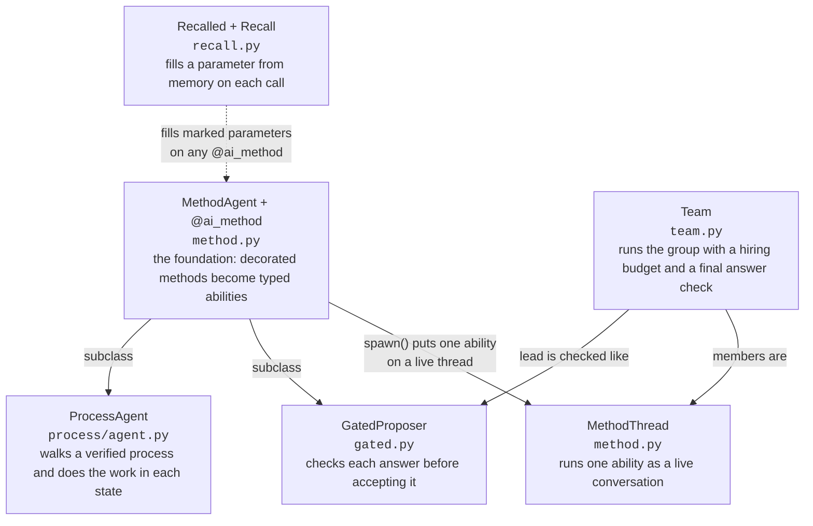
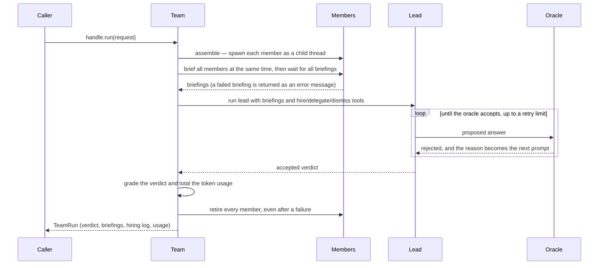
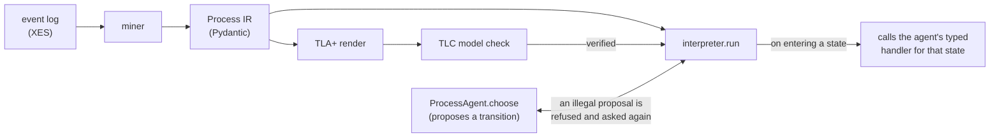

# pneuma

Pneuma is a library for building AI agents as ordinary Python classes, plus a set of
detectors that test whether a safety check or scoring formula actually checks anything.
Each ability of an agent is a method: the docstring is the prompt, the parameters are the
typed inputs, and the return annotation is the typed result. Because abilities are typed
methods, one agent can hand its abilities to another agent as real tools, called with
argument names and types instead of free text.

It builds on [strands-ai-functions](https://github.com/strands-labs/ai-functions), pinned to
upstream commit `e47dc94`, and runs on Python 3.14 with the uv package manager. Live runs
call the claude-opus-5 model through AWS Bedrock; the test suite runs entirely offline
against scripted models.

## Quick start

```bash
uv sync
uv run pytest        # 853 tests: 834 pass, 19 skip (they need live models or optional files)
uv run pneuma        # live Bedrock war-room run, writes artifacts/
uv run pneuma --truth  # print the demo's planted ground truth and exit
```

The `pneuma` command runs one incident investigation: several specialist agents, a lead
holding no evidence, and a hiring budget. It exits non-zero when the oracle rejects the
final answer.

The test suite needs no credentials. A live run needs AWS credentials with Bedrock access
to `global.anthropic.claude-opus-5`, plus `cohere.embed-v4` for the embedding path. The TLC
model-check step needs `java` and `tools/tla2tools.jar` (gitignored; fetch it from the TLA+
releases page). Tests that need a missing file or credential skip rather than fail.

A minimal agent looks like this:

```python
class Analyst(MethodAgent):
    def __init__(self, plane: str):
        self.evidence = load(plane)   # this agent's private context

    @ai_method(Finding, description="Analyze one plane over a window")
    def analyze(
        self,
        advice: Annotated[list[str], Recalled("guidance", k=2)],  # filled from memory on each call
        window: str,                                              # supplied by the caller on each call
    ) -> Finding:
        """Guidance for this decision: {advice}

        My evidence: {self.evidence}
        Analyze the window {window}."""
```

This one method shows the placement rule the whole library follows. The caller supplies
`window`. The library fills `advice` from memory on each call. The prompt reads
`self.evidence`, and callers never see it. Anything a caller supplies, or anything training
improves, comes in through the parameters; anything private stays on `self`.

## Why

Two problems motivate the project.

**Agents talk to each other in untyped prose.** Most multi-agent frameworks connect agents
through free-text messages, so a planner asking a researcher for analysis is one string
hoping another string comes back. Here a research agent hands the planner its
`analyze(topic, depth)` method, and the planner calls it like a function. Wrong shapes fail
at the boundary instead of deep inside a transcript.

**Safety checks can be decoration.** Suppose a parking garage has a rule that no car may go
over 200 mph. Every car passes, but the rule has never checked anything, because no car in
a garage can reach 200 mph in the first place. Scoring formulas fail the same way: a grader
that gives every answer 7 out of 10 tells you nothing. Agent systems are full of rules and
scores like these, and a useless one is dangerous precisely because it always passes. The
code in `src/pneuma/detect/` tests whether a given rule or scoring formula can actually
catch anything, and answers one of three ways: this check works, this check is decoration,
or the test could not tell. The third answer exists so a search that ran out of time is
reported as "could not tell" instead of as a confident pass. The repo runs these detectors
on its own rules and scores too — and they found two bugs in themselves (see the data
section below).

## How it works

### The kernel

Everything starts with `MethodAgent`. The other classes each add one capability on top,
and each removes one way an agent can fail without anyone noticing. Without
`GatedProposer`, a loop can forget to check an answer and a bad answer slips through
looking fine. Without the roster reset in `Team`, a second run can quietly inherit dead
helpers from the first. The kernel turns each of these mistakes into something the code
refuses to do.



| Piece | Module · lines | What it does |
| --- | --- | --- |
| `MethodAgent` + `@ai_method` | `method.py` · 428 | The foundation. A subclass's decorated methods become typed abilities: docstring as prompt, parameters as typed inputs, private context on `self`. `agents()` publishes the abilities as tools another agent can call. |
| `MethodThread` | `method.py` · 428 | Keeps one ability running as a live conversation. Call it twice and the second call remembers the first. You can pause it, copy it into a branch, or shut it down. Shutdown also works when the thread was already killed. |
| `GatedProposer` | `gated.py` · 423 | An agent whose answers are checked before they count. A rejected answer goes straight back to the model with the reason, and it tries again. If the checker itself has a bug, the agent reports it as a bug rather than treating it as a rejected answer. `propose_k` forks parallel branches from one seeded root, and a loop that stops making progress is halted and voiced as a dead end instead of spinning to the retry cap. |
| `Recalled` + `Recall` | `recall.py` · 409 | Lets a method declare, on its signature, that a parameter comes from memory. The library fetches the value on every call and passes it in as a normal argument. Because the value arrives as an argument, the training loop can see it and improve the stored content. |
| `ProcessAgent` | `process/agent.py` · 401 | An agent tied to a verified flowchart. The agent proposes the next step. If the proposal is not allowed, the interpreter refuses it and asks again. The same agent then does the work inside each step it enters. |
| `Team` | `team.py` · 1655 | Runs a group. It spins up the members, briefs them all, and runs a lead that can hire helpers up to a budget. Members share discoveries through a passive worklog that lands at each teammate's next step, never mid-thought. An optional bounded negotiation phase fans the lead's plan to the members for objections before it faces the oracle. The final answer is checked against that oracle, and cleanup runs even when a step fails. |

### How a Team run flows



The hiring seam deserves one note. The lead gets three tools — `hire` creates a helper from
a reviewed catalog, `delegate` gives it work, `dismiss` shuts it down — and each hire
records the hiring agent as the helper's parent, so token costs roll up the family tree the
way a manager's budget covers their reports. The runtime runs tools concurrently, so two
`hire` calls in one turn could both pass the budget check before either registered; the fix
reserves the slot synchronously and only then does the slow work of spawning. An optional
fourth tool, `hire_dynamic`, lets the lead write a new subagent's instructions itself at
runtime — off by default, and every synthesized hire is logged with its instructions
verbatim, because the audit trail is the safety story for prompts nobody reviewed.

### How a ProcessAgent walks a verified process

The process starts as a real event log. A miner turns the log into a typed intermediate
representation (the IR). TLC, the model checker for the TLA+ specification language, checks
the IR. The interpreter only runs the process after that check passes, and the agent only
takes steps the checked process permits.



The flowchart is stored as one data structure, and three things consume it: the TLA+
renderer (so TLC can prove the rules hold in every reachable state), the interpreter (which
runs it step by step and halts a run that stops making progress), and a Hypothesis test
machine that drives the same interpreter down random paths and shrinks any failure to the
smallest failing example. The language model only fills in the data of the flowchart. It
never writes the code that runs it, so a bad model output can produce a wrong flowchart,
which the checker catches, but never wrong machinery.

### The detectors

`src/pneuma/detect/` holds five probes, all reporting through one shared three-valued
verdict (`discrimination.py`):

- `objective.py` probes a scoring formula before any training runs against it. It looks for
  garbage inputs that get the best score, feedback that talks about one number while
  selection uses another, crashes on inputs the formula claims to accept, and a best score
  sitting at the very edge of the searched range.
- `vacuity.py` finds rules that no reachable state can break — the parking-garage problem.
  When a rule never comes close to firing, it loosens the process step by step and retries;
  where the rule first becomes breakable tells you what was pinning it down.
- `adversary.py` hires language models to cheat a scoring formula on purpose, hunting for
  an answer that scores high but is worthless. Finding one cheap win before training starts
  beats finding it after a loop has been optimizing toward it.
- `gaming.py` asks two more questions of a gate: can a candidate score near the maximum
  while a held-out evaluation the gate never saw scores it near the minimum (the gate
  rewards fitting the gate), and is a checker's accepted set really one mechanism wearing
  many coats (near-duplicate accepts).
- `adapter.py` connects the vacuity walk to pneuma's own process IR.

The memory layer (`memory/turso_backend.py`) is the one place the project improves
something the library already has: a libSQL backend that ranks retrieval by meaning using
Cohere Embed v4 embeddings instead of word overlap, learns simple numeric settings from
scored feedback within schema-declared bounds, and measures its own retrieval quality with
test probes so "search works" is a measured claim.

### Library and application

The code is split into two layers. The library layer (`detect`, `gated`, `memory`,
`method`, `model`, `process`, `recall`, `team`) is the reusable part. The application layer
(`casestudy`, `demo`) is this project's own use of it. The rule is that the library must
never depend on the application, and a test enforces it: `tests/library/test_boundary.py`
reads every library file and rejects any import of an application package, even one hidden
inside a function body. A second test imports each library module in a fresh process and
fails if anything from the application layer sneaks in indirectly. Library modules also may
not import the heavy data packages `polars`, `libsql`, or `pm4py`.

### The two data sets, and what they caught

**A business-process log.** `data/receipt.xes` holds 1,434 real building-permit cases from
Dutch municipalities, with 8,577 events across 27 activities. A process model mined from it
looks perfectly healthy, and yet 118 of the 1,434 cases (8.2 percent) skip a verification
step that policy requires. Two separate checks find the same 118 cases, and both run before
any agent starts. The live agent run on this process made 100 decisions, every proposal
legal — and revealed a failure nobody had predicted. The agent never broke a rule. Instead,
in 6 of 10 cases, it dithered: it moved back and forth between valid states until it ran
out of allowed steps. Rule-checking cannot catch dithering because no rule is broken. The
learning loop in `casestudy/learning.py` exists to train the dithering out, and the
interpreter now halts a walk that stops making progress.

**An agent-transcript log.** `data/transcripts_fleet.json` holds this project's own Claude
Code tool-use records, with 3,055 events over 88 cases. It exists to stress the tools on
data with the opposite shape: permit cases mostly repeat (6 percent unique), agent sessions
almost never do (91 percent unique). Running the detectors on it found two bugs in the
detectors themselves. One detector hit its search limit partway through but still reported
its partial result as a confident finding — the exact mistake these tools exist to catch,
happening inside the tool; the fix is the "could not tell" verdict, plus a field naming
which limit was hit. And the objective prober used to ask the caller for examples of bad
answers, but the same person writes the bad-answer list and the scoring formula, so both
shared a blind spot and a genuinely broken formula passed. The fix removes the honor
system: callers describe the shape of the answer space, and the prober derives the bad
answers itself.

One measured result was negative, and stays in this README. The agent that writes its own
mining code was compared with the fixed miner. The agent won on the permit log when the
fixed miner used its default setting; re-run with the setting the agent had chosen for
itself, the fixed miner won on both logs. The agent's real contribution was picking a
better setting, not writing better code.

## Live tests

Some tests are skipped by default because they need a live model. Set the matching variable
to `1` to run them.

| Variable | What the tests do |
| --- | --- |
| `PNEUMA_LIVE_KERNEL` | Runs all five kernel classes against real Bedrock: a thread that remembers its first call, a gated proposal corrected after rejection, a memory recall the optimizer can see, a legal process walk, and a full team run. About seven model calls at low effort, roughly 20 seconds. |
| `PNEUMA_LIVE` | Runs the adversarial search against a real objective. |
| `PNEUMA_LIVE_HARNESS` | Has the agent propose a harness parameter, with the detectors deciding whether to accept it. |
| `PNEUMA_LIVE_MINE` | Checks that gradient feedback reaches both learnable parameters, and compares the learned toolkit with its starting seed. |
| `PNEUMA_LIVE_EMBED` | Measures retrieval quality with real Cohere Embed v4 embeddings. |
| `PNEUMA_LIVE_CACHE` | Measures prompt-cache reuse across fork beams: a k=2 `propose_k` from one seeded root, asserting the second branch reports cache-read tokens. |
| `PNEUMA_LIVE_REPLAY` | Measures cache reads on a counterfactual replay of a recorded thread's suffix. |

The model built by `opus5()` asks Bedrock to cache the prompt prefix on every request, so
byte-identical branches forked by `propose_k` reuse each other's context instead of paying
for it again. Measured on a live k=2 beam with a ~22k-token seed: every call after the
first read the full prefix from the cache (about 99 percent of input tokens at cache-read
rates). Pass `cache=False` to `opus5()` to turn it off.

```bash
PNEUMA_LIVE_KERNEL=1 uv run pytest tests/app/test_kernel_live.py -v
```

## Layout

**Library.** Reusable; nothing here imports from `casestudy/` or `demo/`.

| File | What it holds |
| --- | --- |
| `src/pneuma/method.py` | `@ai_method`, `MethodAgent`, and `MethodThread`. A decorated method becomes a typed AI function, and a thread keeps it running with history. |
| `src/pneuma/gated.py` | `GatedProposer`. The answer check runs as a post-condition, rejections land in a ledger, and a proposer thread can fork into parallel branches. |
| `src/pneuma/recall.py` | The `Recalled` marker and the `Recall` binder. Memory arrives as a normal call argument. |
| `src/pneuma/team.py` | `Team`. Phases, briefings, the hire budget, the worklog, optional negotiation, oracle checks, and teardown. |
| `src/pneuma/process/ir.py` | The process IR: states, guards, effects, and invariants. |
| `src/pneuma/process/tla.py` | Renders the IR to TLA+ and runs the TLC checker over it. |
| `src/pneuma/process/interpreter.py` | Runs a verified IR, validates every choice the agent makes, and halts a run that stops making progress. |
| `src/pneuma/process/agent.py` | `ProcessAgent`, which both walks the process and does the work in each state. |
| `src/pneuma/process/agent_driver.py` | `Navigator`, a small `ProcessAgent` subclass the case study drives. |
| `src/pneuma/process/properties.py` | Builds a Hypothesis test machine from the same IR. |
| `src/pneuma/detect/discrimination.py` | The three-valued verdict all detectors share. |
| `src/pneuma/detect/vacuity.py` | Finds rules that no reachable state can break, using a sweep and four looser retries. |
| `src/pneuma/detect/objective.py` | Probes a scoring function for the four failure modes listed above. |
| `src/pneuma/detect/adversary.py` | Asks language models to find inputs that score well but have no value. |
| `src/pneuma/detect/gaming.py` | Probes a gate for rewarding gate-fitting, and an accepted set for being one mechanism. |
| `src/pneuma/detect/adapter.py` | Connects `vacuity` to pneuma's `Process` IR. |
| `src/pneuma/memory/turso_backend.py` | A libSQL memory backend with vector retrieval and score learning. |
| `src/pneuma/memory/embedding.py` | Calls Cohere Embed v4 on Bedrock and caches the vectors in the same database file. |
| `src/pneuma/model.py` | The claude-opus-5 Bedrock configuration. |

**Case studies.** These modules produce the measurements cited above.

| File | What it holds |
| --- | --- |
| `src/pneuma/casestudy/eventlog.py` | Loads XES event logs into Polars tables and stores them in a libSQL database. |
| `src/pneuma/casestudy/miner.py` | Discovers a process model from a log and measures conformance, bottlenecks, and rework. |
| `src/pneuma/casestudy/pipeline.py` | Runs the six-step study from end to end. |
| `src/pneuma/casestudy/rules.py` | Derives precedence rules from a log and attaches them to a process. |
| `src/pneuma/casestudy/handlers.py` | `Caseworker`, a `ProcessAgent` whose typed methods do the work inside each state. |
| `src/pneuma/casestudy/live.py` | Runs the live experiment that compares neutral and pressured framing. |
| `src/pneuma/casestudy/learning.py` | The training loop. It pulls advice from memory through `Recall` on every decision. |
| `src/pneuma/casestudy/aimine.py` | Has the model write its own mining code, then grades it against the fixed miner. |
| `src/pneuma/casestudy/minelearn.py` | Makes both the miner's guidance and its tools learnable. |
| `src/pneuma/casestudy/harnesslearn.py` | `HarnessProposer`, a `GatedProposer` whose parameter is only accepted when the detectors approve it. |
| `src/pneuma/casestudy/transcriptlog.py` | Loads agent tool-use transcripts as the second data set. |
| `src/pneuma/casestudy/benchmark.py` | Scores the mined model against the standard miners (manual script). |

**Demo.** The incident war-room; ships the project's only console script.

| File | What it holds |
| --- | --- |
| `src/pneuma/demo/warroom.py` | `WarRoom`, the incident room as a `Team` subclass, plus its answer check. |
| `src/pneuma/demo/staffing.py` | `Staff` and `staffing_tools`, the demo's binding of the library's hiring tools. |
| `src/pneuma/demo/agent.py` | The string-prompt `Agent` class the message-bus experiment uses. |
| `src/pneuma/demo/cast.py` | The specialists, the hireable roster, and the incident lead. |
| `src/pneuma/demo/typed_cast.py` | The same cast with typed methods and no message bus. |
| `src/pneuma/demo/incident.py` | Generates a synthetic incident and machine-checks that no single clue gives the answer away. |
| `src/pneuma/demo/cli.py` | The `pneuma` console script: one war-room run that writes `artifacts/`. |

## Documentation

`docs/README.md` is the landing page for the full documentation tree: architecture,
reference, behavior, analysis, diagrams, and insights, all generated from the source with
per-line citations. Each library module also has a hand-written design essay under
`docs/design/` explaining why it is shaped the way it is, and two longer write-ups live at
`docs/case-study.md` and `docs/process.md`.

## Contributing

Run `uv run ruff check` and `uv run pytest` before sending changes; both must pass clean.
The library/application boundary is enforced by tests, so new reusable code belongs in a
library package and anything importing `polars`, `libsql`, or `pm4py` belongs in the
application layer. The upstream library is pinned by git rev rather than PyPI
(`e47dc94e7b8e4b1e3f3e85587d0bc60e78c30296` in both `pyproject.toml` and `uv.lock`);
bumping it is a deliberate change, not a routine update.

`data/receipt.xes` and `data/roadfines.xes` are public XES logs (the second checks that the
tools work on a log they were not built around). The transcript data sets are committed.
Tests that need an absent file skip on their own.

## License

No license file is present yet; until one lands, all rights are reserved by the author.
