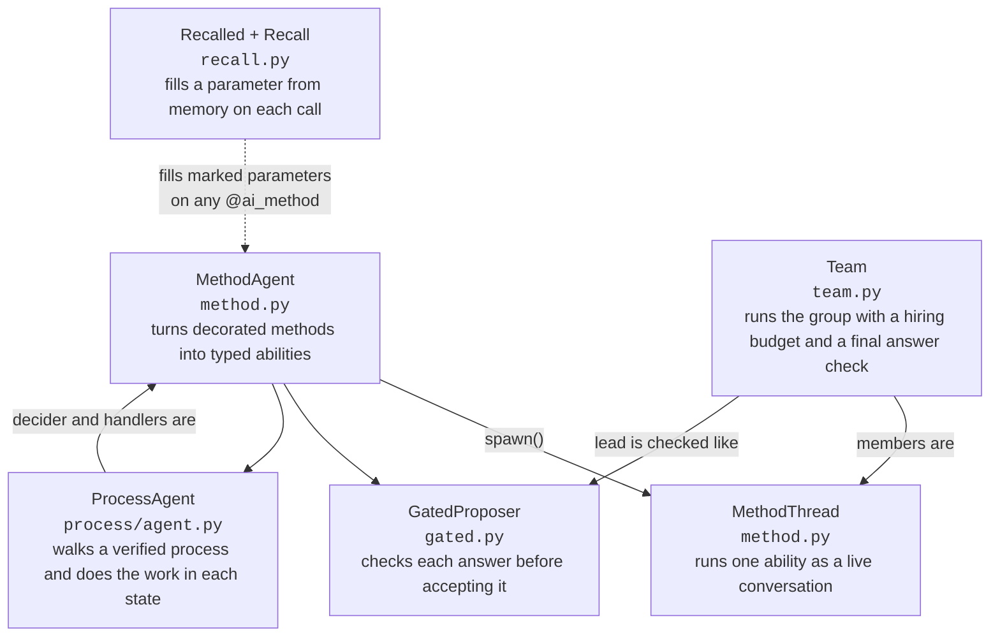
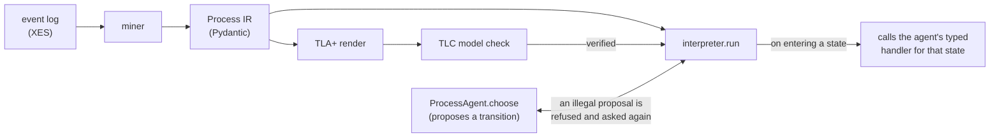

# pneuma

Pneuma is a library for building AI agents as ordinary Python classes. Each ability of an
agent is a method. The method's docstring is the prompt. The method's parameters are the
inputs a caller fills in for each call. The type hints describe how to call the method.
Because of this, one agent can give its abilities to another agent as typed tools. For
example, a research agent can hand a planner agent its `analyze(topic, depth)` method, and
the planner calls it like a function, with real argument names and types instead of a free
text message.

The project also cares about a second problem: useless safety checks. Here is the idea with
an everyday example. Suppose a parking garage has a rule that says no car may go over 200
mph. Every car passes that rule. But the rule has never actually checked anything, because no
car in a garage can reach 200 mph in the first place. The rule looks like a working safety
check, and really it is decoration. Scoring formulas can be useless in the same way. If a
grading formula gives every answer 7 out of 10, the grade tells you nothing, because good
answers and bad answers get the same number.

Agent systems are full of rules and scores like these, and a useless one is dangerous
precisely because it always passes. The code in `src/pneuma/detect/` tests whether a given
rule or scoring formula is actually able to catch anything. It answers one of three ways:
this check works, this check is decoration, or the test could not tell. The third answer
exists so that a search that ran out of time gets reported as "could not tell" instead of as
a confident pass. The repo runs these tests on its own rules and scores too.

The project builds on the [strands-ai-functions](https://github.com/strands-labs/ai-functions)
library, pinned to upstream commit `e47dc94`. It uses the uv package manager and Python 3.14.
Live runs call the claude-opus-5 model through AWS Bedrock. The test suite collects 748
tests. 738 pass and 10 are skipped. Every test runs offline against scripted models, which
are pre-recorded model responses.

## The kernel

The kernel has five classes. Each class removes one way an agent can fail without anyone
noticing. For example, without `GatedProposer`, a loop can forget to check an answer and a
bad answer slips through looking fine. Without the roster reset in `Team`, a second run can
quietly inherit dead helpers from the first run. The kernel turns each of these mistakes
into something the code refuses to do.

The classes also work together. A `Team`'s members are running `MethodThread`s, and they
join the team lead as typed tools. The lead's answer goes through a `GatedProposer` check.
Any agent can pull declared memory through `Recall`. A `ProcessAgent` can be the agent that
walks a verified flowchart.



| Piece | Module · lines | What it does |
| --- | --- | --- |
| `MethodThread` | `method.py` · 428 | Keeps one ability running as a live conversation. Call it twice and the second call remembers the first. You can pause it, copy it into a branch, or shut it down. Shutdown also works when the thread was already killed. |
| `GatedProposer` | `gated.py` · 414 | An agent whose answers are checked before they count. A rejected answer goes straight back to the model with the reason, and it tries again. If the checker itself has a bug, the agent reports it as a bug. It does not treat the bug as a rejected answer. |
| `Recalled` + `Recall` | `recall.py` · 409 | Lets a method declare, on its signature, that a parameter comes from memory. The library fetches the value on every call and passes it in as a normal argument. Because the value arrives as an argument, the training loop can see it and improve the stored content. |
| `ProcessAgent` | `process/agent.py` · 396 | An agent tied to a verified flowchart. The agent proposes the next step. If the proposal is not allowed, the interpreter refuses it and asks again. The same agent then does the work inside each step it enters. |
| `Team` | `team.py` · 968 | Runs a group. It spins up the members, briefs them all, and runs a lead agent that can hire helpers up to a budget. It checks the final answer against an oracle. It cleans everything up at the end. Cleanup runs even when a step fails. |

### How agents split private context from call inputs

Each agent instance keeps its private context on `self`. Private context means things like
its evidence, its process, and its settings. The docstring prompt can read it directly, and
answer-checkers can read it too. Callers do not fill it in, and the training machinery does
not rewrite it. Anything a caller supplies, or anything training improves, comes in through
the method parameters instead. All five kernel classes follow this rule.

```python
class Analyst(MethodAgent):
    def __init__(self, plane: str):
        self.evidence = load(plane)   # this agent's private context

    @ai_method(Finding, description="Analyze one plane over a window")
    def analyze(
        self,
        advice: Annotated[list[str], Recalled("guidance", k=2)],  # filled from memory on each call
        window: str,                                              # supplied by the caller on each call
    ) -> Finding:
        """Guidance for this decision: {advice}

        My evidence: {self.evidence}
        Analyze the window {window}."""
```

This one method shows the whole rule. The caller supplies `window`. The library fills
`advice` from memory on each call. The prompt reads `self.evidence`, and callers never see
it.

### How a Team run flows

```mermaid
sequenceDiagram
    participant C as Caller
    participant T as Team
    participant M as Members
    participant L as Lead
    participant O as Oracle

    C->>T: handle.run(request)
    T->>M: assemble — spawn each member as a child thread
    T->>M: brief all members at the same time, then wait for all briefings
    M-->>T: briefings (a failed briefing is returned as an error message)
    T->>L: run lead with briefings and hire/delegate/dismiss tools
    loop until the oracle accepts, up to a retry limit
        L->>O: proposed answer
        O-->>L: rejected; the reason becomes the next prompt
    end
    L-->>T: accepted verdict
    T->>T: grade the verdict and total the token usage
    T->>M: retire every member, even after a failure
    T-->>C: TeamRun (verdict, briefings, hiring log, usage)
```

### How a ProcessAgent walks a verified process

The process starts as a real event log. A miner turns the log into a typed intermediate
representation, called the IR. TLC, the model checker for the TLA+ specification language,
then checks the IR. The interpreter only runs the process after that check passes. The agent
proposes each next step, and the interpreter only allows steps that the checked process
permits.



## What this adds over the library

We checked every claim in this list by reading the vendored library source. The library has
none of the following features.

1. **Probing an objective before training** (`detect/objective.py`). An objective is the
   scoring formula a training loop tries to maximize. If the formula is broken, the loop
   happily trains toward garbage. The library ships the training tools
   (`TextGradOptimizer` and `GradFeedback(text, score)`) but no way to test the formula
   itself. Our prober tests it before any training runs. It looks for four failure modes.
   First, a garbage input gets the best score, for example an empty answer scoring 10 out
   of 10. Second, the written feedback talks about one number while the selection actually
   uses a different one, so the model is coached toward the wrong target. Third, the
   formula crashes on an input it claims to accept. Fourth, the best score sits at the
   very edge of the range that was searched, which usually means the range was too small
   and the true best value is outside it. The prober uses only the Python standard
   library.
2. **Detecting rules that can never fire** (`detect/vacuity.py` and `detect/adapter.py`).
   This is the parking-garage problem from the top of this README. A model checker is a
   tool that explores every state a process can reach and reports whether any of them
   breaks a rule. It answers "did anything break the rule?" but never "could anything have
   broken the rule?" Our check answers the second question. It explores the reachable
   states, and if the rule never even came close to firing, it loosens the process step by
   step and tries again. Where the rule first becomes breakable tells you what was pinning
   it down. For example, if the rule only becomes breakable after freeing the starting
   values, then the starting values were what made it decoration.
3. **A shared verdict type** (`detect/discrimination.py`, standard library only). Features
   1 and 2 both return the same kind of answer: this check works, this check is
   decoration, or the test could not tell. "Could not tell" exists for cases like a search
   that hit its time limit before finishing. Without it, an unfinished search and a real
   pass would both come back as the same result. When the test could not tell, the result
   also names the specific limit it hit, so a reader knows what to raise and rerun.
4. **Searching an objective for cheap wins** (`detect/adversary.py`). This module hires
   language models to cheat a scoring formula on purpose. Each model gets a tool that runs
   the formula and can read its source code. The model then hunts for an answer that
   scores high but is actually worthless, the way a student might find that writing
   "see above" earns full marks from a lazy grader. Finding one cheap win before training
   starts is much better than finding out after a training loop has been optimizing toward
   it.
5. **Running only checked processes** (`process/`). A process here is a business workflow
   written as a flowchart with rules, for example "a permit case must pass verification
   before payment." The flowchart is stored as one data structure, and three things consume
   it. A renderer translates it into TLA+, a specification language, so the TLC model
   checker can prove the rules hold in every reachable state. An interpreter runs the
   flowchart step by step. A test machine built with Hypothesis, a property-based testing
   library, drives that same interpreter down random paths and, when a path fails, shrinks
   it to the smallest failing example. The language model only fills in the data of the
   flowchart. It never writes the code that runs it, so a bad model output can produce a
   wrong flowchart, which the checker catches, but never wrong machinery.
6. **Methods as AI functions** (`method.py`), plus the four kernel classes built on it
   (`gated.py`, `recall.py`, `process/agent.py`, `team.py`). The library's decorator works
   on standalone functions. This project's `@ai_method` works on methods of a class, which
   means each agent instance can carry its own private context on `self` while the method
   keeps a clean typed signature for callers. The code example in the kernel section above
   shows this shape.
7. **Letting a team hire within a budget** (`team.py`, with the demo's binding in
   `demo/staffing.py`). The library lets an agent talk to other agents that already exist,
   but gives it no way to create one. This project adds three tools: `hire` creates a
   helper agent, `delegate` gives it work, and `dismiss` shuts it down. Each hire records
   the hiring agent as the helper's parent, so token costs roll up the family tree the way
   a manager's budget covers their reports. One subtle bug got a specific fix. The runtime
   runs tools at the same time, so two `hire` calls in one turn could both pass the "are
   we under the cap?" check before either one registered. The fix reserves the slot first
   and only then does the slow work of spawning.

The last item improves something the library already has.

8. **Storing and retrieving memory with vectors** (`memory/turso_backend.py`). An agent's
   memory here is a set of text entries it can search when making a decision. The
   library's built-in backends rank search results by word overlap (a scheme called BM25),
   which misses entries that say the same thing in different words. This backend ranks by
   meaning instead. It converts each entry into an embedding, a list of numbers that
   captures meaning, using the Cohere Embed v4 model, and compares them inside the
   database. It can also learn simple numeric settings from scored feedback, adjusting a
   value a little at a time within the bounds its schema declares. Finally, it measures its
   own retrieval quality with test probes, so "search works" is a measured claim and not
   an assumption. The library does not measure retrieval quality at all.

## Library and application packages

The code is split into two layers. The library layer (detect, gated, memory, method, model,
process, recall, team) is the reusable part someone else could adopt. The application layer
(casestudy, demo) is this project's own use of it. The rule is that the library must never
depend on the application, the same way a toolbox should not depend on one particular house
it helped build.

A test enforces the rule instead of trusting people to follow it. `tests/library/test_boundary.py`
reads every library file and rejects any import of an application package, even an import
hidden inside a function body. A second test imports each library module in a fresh Python
process and fails if anything from the application layer sneaks in indirectly. Library
modules also may not import the heavy data packages `polars`, `libsql`, or `pm4py`.

During each kernel refactor, the application's test files were left untouched on purpose.
They still passed afterward, which is the evidence that the refactor changed the code's
shape without changing what it does.

## The two data sets

**A business-process log.** `data/receipt.xes` holds 1,434 real building-permit cases from
Dutch municipalities, with 8,577 events across 27 activities. This log matters because it
shows the problem is real and not invented. A process model mined from it looks perfectly
healthy, and yet 118 of the 1,434 cases (8.2 percent) skip a verification step that policy
requires. Two separate checks find the same 118 cases, and both run before any agent
starts. The live agent run on this process made 100 decisions, and every proposal was
legal. That run also revealed a failure nobody had predicted. The agent never broke a rule.
Instead, in 6 of 10 cases, it dithered. It moved back and forth between valid states, like
someone pacing between two rooms, until it ran out of allowed steps. Rule-checking cannot
catch dithering because no rule is broken. The learning loop in `casestudy/learning.py`
exists to train the dithering out.

**An agent-transcript log.** `data/transcripts_fleet.json` holds this project's own Claude
Code tool-use records, with 3,055 events over 88 cases. This second log exists to stress the
tools on data with the opposite shape. Permit cases mostly follow the same few paths, so
only 6 percent of them are unique. Agent sessions almost never repeat, so 91 percent of them
are unique. A tool that only works on tidy, repetitive data breaks here.

And two tools did break. Running the detectors on the second data set found two bugs in the
detectors themselves.

- One detector hit its search limit partway through, but still reported its partial result
  as a confident finding. That is the exact mistake these tools exist to catch, happening
  inside the tool. The fix is the "could not tell" verdict described above, plus a field
  that names which limit was hit.
- The objective prober asked the caller to supply examples of bad answers, and then checked
  whether they scored poorly. The problem is that the same person writes the bad-answer
  list and the scoring formula, so both can share the same blind spot. In our case they
  did, and a genuinely broken formula passed with zero findings. The fix removes the
  honor system. Callers now describe the shape of the answer space, and the prober derives
  the bad answers itself.

One measured result was negative, and the README keeps it. The agent that writes its own
mining code was compared with the fixed miner. The agent won on the permit log when the
fixed miner used its default setting. Then the fixed miner was re-run with the setting the
agent had chosen for itself, and the fixed miner won on both logs. In plain terms, the
agent's real contribution was picking a better setting, not writing better code.

## Run it

```bash
uv sync
uv run pytest -p no:randomly     # 738 passed, 10 skipped
uv run pneuma                    # live Bedrock run, writes artifacts/
uv run pneuma --truth            # print the demo's planted ground truth and exit
```

Always pass `-p no:randomly`. The suite runs tests in a random order by default, so two bare
runs can fail in different ways. The `pneuma` command exits with a non-zero code when the
oracle rejects the final answer.

Ten tests are skipped by default because they need a live model. Set the matching variable to
`1` to run one.

| Variable | What the test does |
| --- | --- |
| `PNEUMA_LIVE` | Runs the adversarial search against a real objective. |
| `PNEUMA_LIVE_HARNESS` | Has the agent propose a harness parameter, with the detectors deciding whether to accept it. |
| `PNEUMA_LIVE_MINE` | Checks that gradient feedback reaches both learnable parameters, and compares the learned toolkit with its starting seed. |
| `PNEUMA_LIVE_EMBED` | Measures retrieval quality with real Cohere Embed v4 embeddings. |

## Layout

**Library.** These packages are reusable. Nothing here imports from `casestudy/` or `demo/`.

| File | What it holds |
| --- | --- |
| `src/pneuma/method.py` | Defines `@ai_method`, `MethodAgent`, and `MethodThread`. A decorated method becomes a typed AI function, and a thread keeps it running with history. |
| `src/pneuma/gated.py` | Defines `GatedProposer`. The answer check runs as a post-condition. Rejections are stored in a ledger. A proposer thread can fork into parallel branches. |
| `src/pneuma/recall.py` | Defines the `Recalled` marker and the `Recall` binder. Memory arrives as a normal call argument. |
| `src/pneuma/team.py` | Defines `Team`. It runs the phases, waits for all briefings, enforces the hire budget, checks answers with the oracle, and tears everything down. |
| `src/pneuma/process/ir.py` | Defines the process IR: states, guards, effects, and invariants. |
| `src/pneuma/process/tla.py` | Renders the IR to TLA+ and runs the TLC checker over it. |
| `src/pneuma/process/interpreter.py` | Runs a verified IR and validates every choice the agent makes. It calls an optional hook when the run enters a state. |
| `src/pneuma/process/agent.py` | Defines `ProcessAgent`, which both walks the process and does the work in each state. |
| `src/pneuma/process/agent_driver.py` | Defines `Navigator`, a small `ProcessAgent` subclass the case study drives. |
| `src/pneuma/process/properties.py` | Builds a Hypothesis test machine from the same IR. |
| `src/pneuma/detect/discrimination.py` | Defines the three-valued verdict both detectors share. |
| `src/pneuma/detect/vacuity.py` | Finds rules that no reachable state can break, using a sweep and four looser retries. |
| `src/pneuma/detect/objective.py` | Probes a scoring function for the four failure modes listed above. |
| `src/pneuma/detect/adversary.py` | Asks language models to find inputs that score well but have no value. |
| `src/pneuma/detect/adapter.py` | Connects `vacuity` to pneuma's `Process` IR. |
| `src/pneuma/memory/turso_backend.py` | Defines a libSQL memory backend with vector retrieval and score learning. |
| `src/pneuma/memory/embedding.py` | Calls Cohere Embed v4 on Bedrock and caches the vectors in the same database file. |
| `src/pneuma/model.py` | Holds the claude-opus-5 Bedrock configuration. |

**Case studies.** These modules produce the measurements cited above.

| File | What it holds |
| --- | --- |
| `src/pneuma/casestudy/eventlog.py` | Loads XES event logs into Polars tables and stores them in a libSQL database. |
| `src/pneuma/casestudy/miner.py` | Discovers a process model from a log and measures conformance, bottlenecks, and rework. |
| `src/pneuma/casestudy/pipeline.py` | Runs the six-step study from end to end. |
| `src/pneuma/casestudy/rules.py` | Derives precedence rules from a log and attaches them to a process. |
| `src/pneuma/casestudy/handlers.py` | Defines `Caseworker`, a `ProcessAgent` whose typed methods do the work inside each state. |
| `src/pneuma/casestudy/live.py` | Runs the live experiment that compares neutral and pressured framing. |
| `src/pneuma/casestudy/learning.py` | Runs the training loop. It pulls advice from memory through `Recall` on every decision. |
| `src/pneuma/casestudy/aimine.py` | Has the model write its own mining code, then grades it against the fixed miner. |
| `src/pneuma/casestudy/minelearn.py` | Makes both the miner's guidance and its tools learnable. |
| `src/pneuma/casestudy/harnesslearn.py` | Defines `HarnessProposer`, a `GatedProposer` whose parameter is only accepted when the detectors approve it. |
| `src/pneuma/casestudy/transcriptlog.py` | Loads agent tool-use transcripts as the second data set. |
| `src/pneuma/casestudy/benchmark.py` | Scores our mined model against the standard miners. |

**Demo.** This package holds the incident war-room. It ships the project's only console
script.

| File | What it holds |
| --- | --- |
| `src/pneuma/demo/warroom.py` | Defines `WarRoom`, the incident room as a `Team` subclass, plus its answer check. |
| `src/pneuma/demo/staffing.py` | Defines `Staff` and `staffing_tools`, the demo's binding of the library's hiring tools. |
| `src/pneuma/demo/agent.py` | Defines the string-prompt `Agent` class the message-bus experiment uses. |
| `src/pneuma/demo/cast.py` | Defines the specialists, the hireable roster, and the incident lead. |
| `src/pneuma/demo/typed_cast.py` | Builds the same cast with typed methods and no message bus. |
| `src/pneuma/demo/incident.py` | Generates a synthetic incident and machine-checks that no single clue gives the answer away. |
| `src/pneuma/demo/cli.py` | Runs the `pneuma` console script: one war-room run that writes `artifacts/`. |

Each kernel module has a design document under `docs/design/`: `method.md`, `gated.md`,
`recall.md`, `process_agent.md`, and `team.md`. Two longer write-ups live at
`docs/case-study.md` and `docs/process.md`.

## Notes

The library is pinned by git rev rather than PyPI, to
`e47dc94e7b8e4b1e3f3e85587d0bc60e78c30296` in both `pyproject.toml` and `uv.lock`.

`data/receipt.xes` and `data/roadfines.xes` are public XES logs. The second one is used to
check that the tools work on a log they were not built around. Tests that need either file
skip when it is absent. The transcript data sets are committed.

The TLC step needs `java` and `tools/tla2tools.jar`. The jar is gitignored; fetch it from the
TLA+ releases page. Tests that need it skip when it is absent. Everything else runs offline
against scripted models.

A live run needs AWS credentials with Bedrock access to `global.anthropic.claude-opus-5`,
plus `cohere.embed-v4` for the embedding path. The test suite needs neither.
