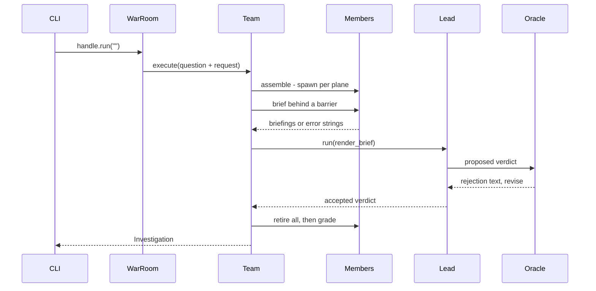
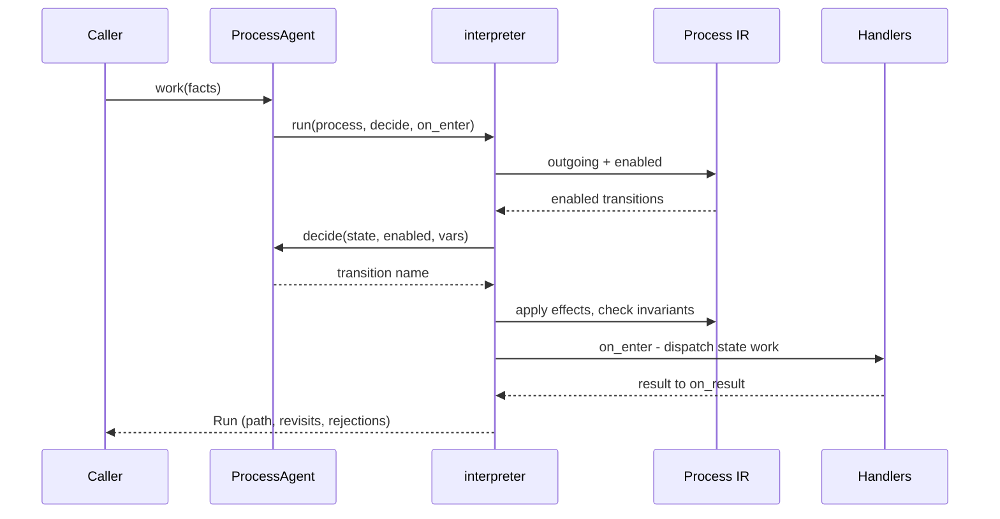
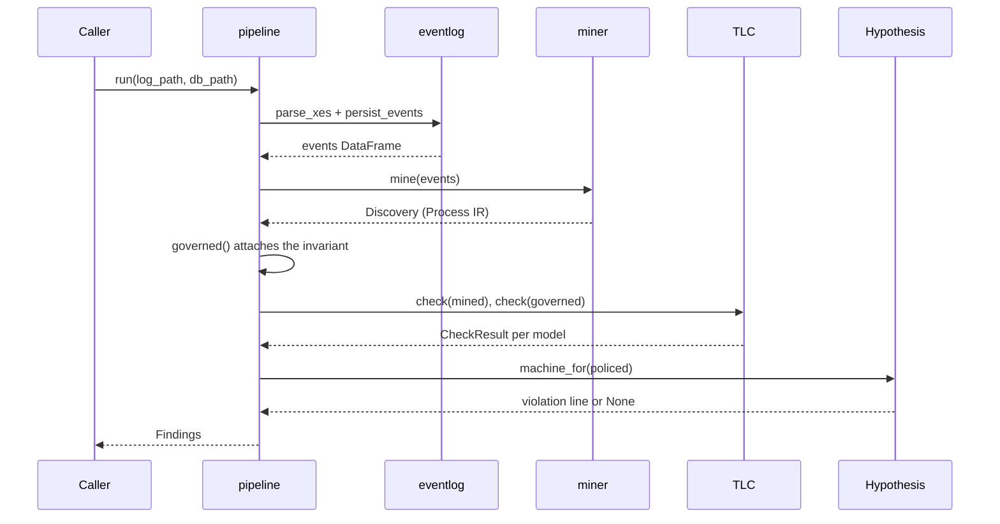

# pneuma · Data flow

`pneuma` is a library with one console script, `pneuma = "pneuma.demo.cli:main"` (`pyproject.toml:22-23`). Only Flow 1 has a true external trigger. Flows 2 and 3 are the top public-export call chains — `ProcessAgent.work` (`src/pneuma/process/agent.py:267`) and `pipeline.run` (`src/pneuma/casestudy/pipeline.py:120`) — substituted for request lifecycles per the library-shaped fallback.

## Flow 1: War-room investigation (`pneuma` console script)

1. `main` parses `--max-hires`, `--out`, `--quiet`, `--truth`, and on the non-truth path calls `asyncio.run(investigate(...))`, returning 0 only when the oracle graded the verdict correct (`src/pneuma/demo/cli.py:117`).
2. `investigate` stands up an `InMemoryCoordinator`, registers a `LocalWorker`, constructs `WarRoom(question=QUESTION, max_hires=max_hires)`, and spawns it as a thread (`src/pneuma/demo/cli.py:26-47`).
3. `handle.run("")` drives the room with an empty request; `WarRoom.execute` prepends the room's standing question before delegating to the base skeleton (`src/pneuma/demo/warroom.py:177`).
4. `Team.execute` captures a usage baseline, replaces the roster per run, lists `members()`, and composes the gated lead before anything is spawned (`src/pneuma/team.py:1122`).
5. `Team.assemble` spawns each of the four `Specialist` members sequentially as children of the team thread, writing the `THREAD_SPAWNED` edge the token rollup later walks (`src/pneuma/team.py:1219`).
6. `WarRoom.brief` awaits the base barrier — `asyncio.gather` over every member's `ask` with `return_exceptions=True` — then re-keys the answers by telemetry plane (`src/pneuma/demo/warroom.py:186`).
7. `lead_handle.run(self.render_brief(request, briefings))` runs the `IncidentLead`, whose `hire`/`delegate`/`dismiss` tools come from `staffing_tools` and whose answer must pass `WarRoom.oracle` as a post-condition; a rejection returns as assertion text the model revises against (`src/pneuma/team.py:1187`).
8. The `finally` retires every member, every hire, and the lead; `grade` re-runs `incident.verify` for the reader, `subtree_usage` totals the tokens, and an `Investigation` is returned, which `investigate` writes to `artifacts/investigation.json` (`src/pneuma/team.py:1194-1217`, `src/pneuma/demo/cli.py:56`).

## Flow 2: Verified process walk (`ProcessAgent.work`)

1. `ProcessAgent.work(facts=...)` first calls `_check_no_decider_handler`, refusing any state that names `choose` as its `agent_method` before a single model call is compiled or spent (`src/pneuma/process/agent.py:267`).
2. `work` resolves `self.process.state_map` once, defines an `on_enter` closure over it, and hands both the decider and the hook to the interpreter (`src/pneuma/process/agent.py:317-330`).
3. `interpreter.run` seeds the variables from `process.initial_assignments()[0]`, asserts invariants at the initial state, sets the history and revisit `ContextVar`s, and calls `on_enter` for the initial state inside that scope (`src/pneuma/process/interpreter.py:176`).
4. Per step, `process.outgoing(current)` is filtered by `Transition.enabled(variables)`; an empty result raises `Deadlock` (`src/pneuma/process/interpreter.py:256-258`).
5. `_elicit` takes a lone enabled transition without asking anybody; at a real branch it calls `decide` and rejects any name outside the enabled set, up to `max_rejections`, then raises `ProcessError` (`src/pneuma/process/interpreter.py:325`).
6. `ProcessAgent.decider`'s inner `decide` renders the choice with `interpreter.offer(state, enabled, variables)` — which marks already-visited targets `[REVISIT]` — calls the compiled `choose` capability, and returns `choice.transition` (`src/pneuma/process/agent.py:137`).
7. The chosen transition's `Effect.apply` updates the variables, the step is appended, a re-entered state is recorded as a `Revisit`, and `_assert_invariants` re-checks every invariant; five consecutive revisits raise `NoProgress` (`src/pneuma/process/interpreter.py:262-302`).
8. `on_enter` then calls `ProcessAgent.dispatch`, which resolves the state's handler via `handler_for`, awaits the compiled `@ai_method`, feeds the result to `on_result`, and re-raises any fault as `HandlerFailed`; the loop returns the `Run` on reaching a terminal state (`src/pneuma/process/agent.py:222`).

## Flow 3: Case-study pipeline (`pipeline.run`)

1. `pipeline.run(log_path, db_path, ...)` executes the whole six-step study and persists every artifact (`src/pneuma/casestudy/pipeline.py:120`).
2. `eventlog.parse_xes(log_path)` streams the XES file with `iterparse`, clearing each trace, into one Polars row per event (`src/pneuma/casestudy/eventlog.py:43`).
3. `eventlog.connect` / `init_schema` / `persist_events` open the libSQL database and write the events (`src/pneuma/casestudy/pipeline.py:131-133`).
4. `miner.mine(events, name=..., min_edge_cases=...)` discovers a `Process` from the directly-follows graph and returns a `Discovery` with coverage and dropped share; `_record_model` stores its IR JSON (`src/pneuma/casestudy/miner.py:84`).
5. `measure_control_skip(events)` groups each case's activity path and counts the cases that never perform `T02 Check confirmation of receipt`, broken out by channel (`src/pneuma/casestudy/pipeline.py:102`).
6. `governed(discovery.process)` attaches the derived precedence rule as a `checked` variable plus the `NoDetermineWithoutCheck` invariant, producing the policed IR (`src/pneuma/casestudy/pipeline.py:55`).
7. When TLC is available, `tla.check` model-checks both the mined and the policed IR under a 300-second timeout, and each `CheckResult` is recorded through `_record_check` (`src/pneuma/process/tla.py:269`).
8. `_property_test(policed)` builds a Hypothesis machine with `properties.machine_for` and drives 400 examples of up to 14 steps through the same interpreter, returning the first violation line; the result is recorded, the connection committed, and `Findings` returned (`src/pneuma/casestudy/pipeline.py:179`).

## See also

- [Module map][module-map] — 10 shared source files
- [Processes][processes] — 10 shared source files
- [Impact analysis][impact-analysis] — 10 shared source files
- [Sequences][sequences] — 9 shared source files
- [Debugging guide][debugging-guide] — 9 shared source files

[module-map]: module-map.md
[processes]: ../behavior/processes.md
[impact-analysis]: ../insights/impact-analysis.md
[sequences]: ../diagrams/behavioral/sequences.md
[debugging-guide]: ../insights/debugging-guide.md
