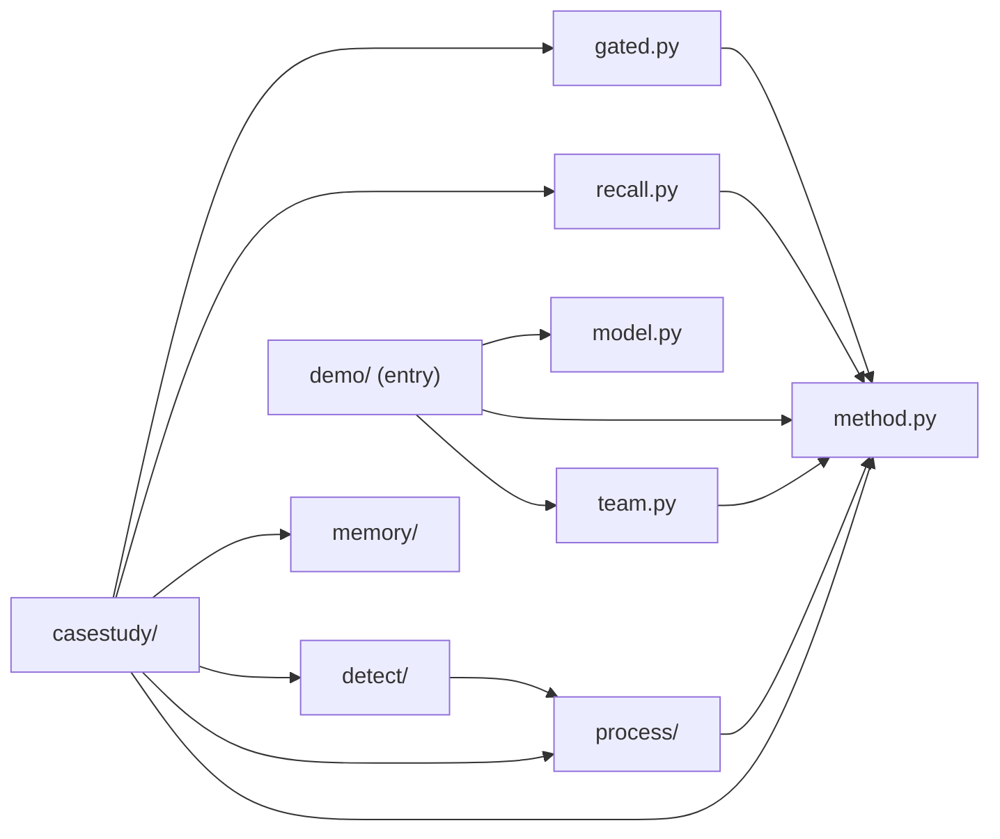

# pneuma · System overview

Pneuma is a Python library for building AI agents as ordinary classes, packaged as `pneuma` version `0.1.0` (`pyproject.toml:2-3`). Its premise is that an agent's ability should be a method: the docstring is the prompt, the parameters are the typed inputs, and the return annotation is the typed result (`README.md:5-6`). The `@ai_method` decorator and the `MethodAgent` / `MethodThread` pair implement that shape (`src/pneuma/method.py:79`, `src/pneuma/method.py:163`, `src/pneuma/method.py:326`) (428 LOC). Because each ability carries a real signature, one agent can hand another its methods as typed tools instead of free text (`README.md:6-8`). The project pursues a second concern alongside it: safety checks and scoring formulas that always pass and therefore measure nothing (`README.md:67-79`). It builds on `strands-ai-functions`, pinned to git rev `e47dc94e7b8e4b1e3f3e85587d0bc60e78c30296` (`pyproject.toml:19`), and requires Python `>=3.14` (`pyproject.toml:5`).

The code splits into a reusable library layer and an application layer, and the boundary is declared by hand rather than inferred: `LIBRARY = {"detect", "gated", "memory", "method", "model", "process", "recall", "team"}` and `APPLICATION = {"casestudy", "demo"}` (`tests/library/test_boundary.py:46-47`). A test rejects any library import of an application package, and blocks the heavy dependencies `polars`, `libsql`, and `pm4py` from the library side (`tests/library/test_boundary.py:50`).

Four library modules build directly on `method`. `gated` adds `GatedProposer`, an agent whose answers pass a check before they count (`src/pneuma/gated.py:101`) (423 LOC). `recall` lets a signature declare that a parameter is filled from memory on each call (`src/pneuma/recall.py:60`) (409 LOC). `team` runs a group: it assembles members, enforces a hiring cap, and grades the lead against an oracle (`src/pneuma/team.py:780`, `src/pneuma/team.py:499`, `src/pneuma/team.py:962`) (1655 LOC). `process` ties an agent to a verified flowchart — a Pydantic `Process` IR (`src/pneuma/process/ir.py:213`), a TLA+ renderer that shells out to `tools/tla2tools.jar` (`src/pneuma/process/tla.py:28`), and an interpreter that refuses any illegal proposal and raises on deadlock or invariant violation (`src/pneuma/process/interpreter.py:258`, `src/pneuma/process/interpreter.py:357`).

`detect` is the largest library package at 7 files and 4176 LOC. It probes objectives and rules for the always-passes failure, returning a three-valued `Discrimination` whose `withheld` field names every bound the search hit, so an unfinished search never reads as a confident pass (`src/pneuma/detect/discrimination.py:45`, `src/pneuma/detect/discrimination.py:56-59`). `detect/adapter.py` is the one place `detect` reaches into `process` (`src/pneuma/detect/adapter.py:26`) (228 LOC). `memory` supplies a libSQL vector backend that embeds entries with `global.cohere.embed-v4:0` (`src/pneuma/memory/embedding.py:45`) (286 LOC).

The application layer consumes those pieces. `casestudy` is the widest module — 15 files, 6011 LOC — and imports `method`, `process`, `detect`, `memory`, `recall`, and `gated` (`src/pneuma/casestudy/handlers.py:31-33`, `src/pneuma/casestudy/learning.py:57-61`, `src/pneuma/casestudy/rules.py:46`, `src/pneuma/casestudy/harnesslearn.py:67`). `demo` ships the project's only console script, `pneuma = "pneuma.demo.cli:main"` (`pyproject.toml:22`); `main()` runs one war-room investigation and exits non-zero when the oracle rejects the verdict (`src/pneuma/demo/cli.py:117`, `src/pneuma/demo/cli.py:144-145`) (149 LOC). Read `src/pneuma/method.py` first, then `src/pneuma/demo/cli.py`.

## Stack

| Layer | Technology | Source |
| --- | --- | --- |
| Language | Python `>=3.14` | `pyproject.toml:5` |
| Agent runtime | `strands-agents>=1.50.0`, `strands-ai-functions` at rev `e47dc94` | `pyproject.toml:7-8`, `pyproject.toml:19` |
| Model | `global.anthropic.claude-opus-5` on Bedrock, region `us-east-1` | `src/pneuma/model.py:9-10` |
| Embeddings | `global.cohere.embed-v4:0` | `src/pneuma/memory/embedding.py:45` |
| Typing / data | `pydantic>=2.4.0`, `polars>=1.43.1` | `pyproject.toml:9`, `pyproject.toml:11` |
| Storage | `libsql>=0.1.11`, `pyturso>=0.7.2` | `pyproject.toml:12-13` |
| Console output | `rich>=13.7` | `pyproject.toml:10` |
| Verification | `tools/tla2tools.jar` via `java`, `hypothesis>=6.163.0` | `src/pneuma/process/tla.py:28`, `pyproject.toml:26` |
| Test tooling | `pytest>=8.0`, `pytest-asyncio>=0.24`, `asyncio_mode = "auto"` | `pyproject.toml:28-29`, `pyproject.toml:41` |
| Build / lint | `hatchling`, `ruff>=0.6` at `line-length = 100` | `pyproject.toml:34-35`, `pyproject.toml:30`, `pyproject.toml:50` |
| Process mining | `pm4py>=2.7.23.3` | `pyproject.toml:27` |

## Module map

## See also

- [Module map][module-map] — 19 shared source files
- [Impact analysis][impact-analysis] — 17 shared source files
- [Processes][processes] — 15 shared source files
- [Business logic][business-logic] — 15 shared source files
- [Contract map][contract-map] — 14 shared source files

[module-map]: module-map.md
[impact-analysis]: ../insights/impact-analysis.md
[processes]: ../behavior/processes.md
[business-logic]: ../insights/business-logic.md
[contract-map]: ../insights/contract-map.md
