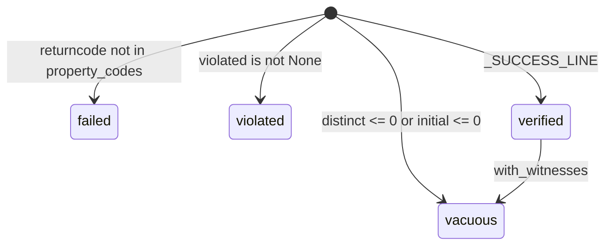
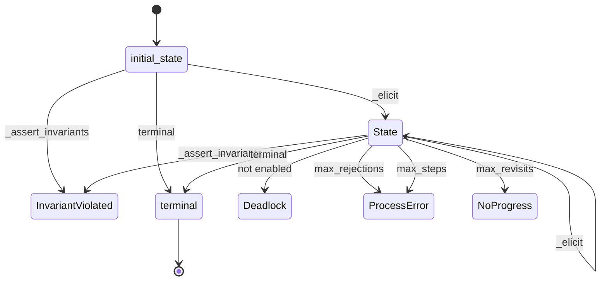
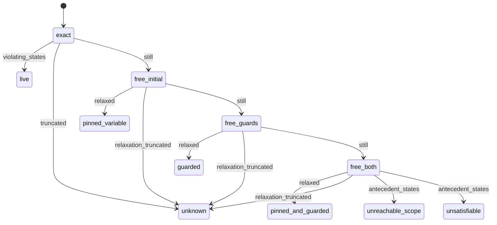
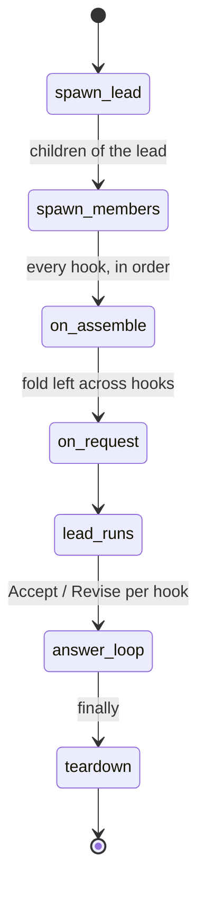
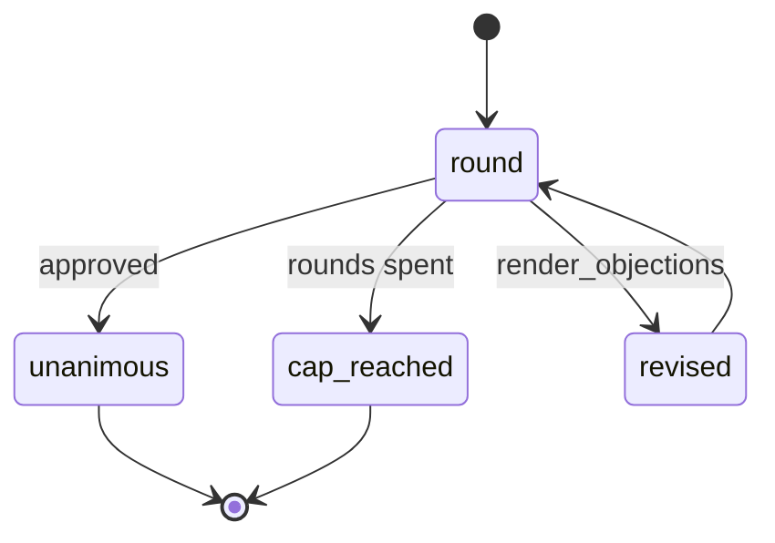

# pneuma · State machines

## CheckResult.outcome

The verdict TLC's output is classified into. The four states are declared as a closed
`Literal` at `src/pneuma/process/tla.py:30`, and `ok` is true for `verified` alone
(`src/pneuma/process/tla.py:74-76`). `_parse` walks the ladder below in source order, so an
earlier branch wins: a broken checker is `failed` before a reported violation can make it
`violated`. `with_witnesses` is the one edge between two settled states — a `verified` result
whose invariants had zero witness states is downgraded to `vacuous`
(`src/pneuma/process/tla.py:98-101`).

- Entry classifier: `src/pneuma/process/tla.py:369-388`.
- Second transition site: `with_witnesses`, `src/pneuma/process/tla.py:90-101`.
- No state is marked terminal in source — these are values of a frozen dataclass field, and
  `with_witnesses` proves `verified` is not final. No `--> [*]` is drawn.

Defined at: `src/pneuma/process/tla.py:30`

## Process

The mined-process IR itself: a machine whose states, transitions, guards and effects are data
rather than code (`src/pneuma/process/ir.py:213-222`). `interpreter.run` walks it, and the
walk has its own enumerated outcomes — one success and four named refusals, each a
`ProcessError` subclass (`src/pneuma/process/interpreter.py:98-140`). `initial_state` is the
declared entry (`src/pneuma/process/ir.py:219`); a `State` carrying `terminal` is the declared
exit (`src/pneuma/process/ir.py:186`), and the IR refuses to validate without at least one
(`src/pneuma/process/ir.py:273-274`).

`State` is aliased to `step` in the diagram above only because `State` is a reserved word in
Mermaid's `stateDiagram-v2` grammar; the rendered label is the source identifier
(`src/pneuma/process/ir.py:175`) verbatim.

- Guards decide which transitions are enabled: `Transition.enabled`,
  `src/pneuma/process/interpreter.py:256` selecting over `src/pneuma/process/ir.py:171-172`.
- Effects are applied on the chosen edge before the target is entered:
  `src/pneuma/process/interpreter.py:262-264`.
- `_elicit` takes a lone enabled transition without consulting the decider
  (`src/pneuma/process/interpreter.py:338-339`), and raises `ProcessError` after
  `max_rejections` illegal proposals (`src/pneuma/process/interpreter.py:343-351`).
- `terminal` is checked at the top of the loop and again after the last budgeted step, so a run
  that lands on a terminal state with the budget exactly spent completes rather than raising
  (`src/pneuma/process/interpreter.py:252-254`, `src/pneuma/process/interpreter.py:315-317`).

Defined at: `src/pneuma/process/ir.py:213`

## RuleVerdict.cause

Why a rule could not be broken, named by the relaxation level at which it first becomes
breakable. The four levels are ordered weakest-constraint-last at
`src/pneuma/detect/vacuity.py:61` and that order is load-bearing: the sound widening
`free_initial` must precede the unsound `free_guards`, or the gate inverts
(`src/pneuma/detect/vacuity.py:19-28`). `audit` builds a system per level and only for the
levels still needed, dropping each rule that became breakable
(`src/pneuma/detect/vacuity.py:640-660`). `RuleVerdict.cause` then reads the per-level breach
counts back and names the diagnosis (`src/pneuma/detect/vacuity.py:458-474`); the six values it
can return are closed at `src/pneuma/detect/vacuity.py:63-71`.

- `live` is where `cause` returns None: the rule fires in the system as written, so there is
  nothing to explain (`src/pneuma/detect/vacuity.py:370-382`,
  `src/pneuma/detect/vacuity.py:464-465`).
- `unknown` is reachable from every level because a truncated sweep withdraws the diagnosis
  rather than the pass: `truncated` covers `exact`, `relaxation_truncated` covers the relaxed
  levels (`src/pneuma/detect/vacuity.py:466-467`, `src/pneuma/detect/vacuity.py:654-659`).
- `unreachable_scope` and `unsatisfiable` split on whether the rule's subject was reachable at
  all (`src/pneuma/detect/vacuity.py:474`).
- The five cause states are terminal in the sense that nothing re-derives them, but source marks
  no terminal explicitly — `cause` is a computed property, not a stored field. No `--> [*]` is
  drawn.

Defined at: `src/pneuma/detect/vacuity.py:63`

## Team.run

The core pipeline in ordinary `asyncio` with no model anywhere in the control flow, which is
what makes a run reproducible (`src/pneuma/team/core.py:202-262`). The lead's thread is
registered first (not running), every member spawns as its child, hooks run `on_assemble` then
fold the request through `on_request`, the lead runs once, and the answer loop reviews the
result. The duplicate-name guard fires at construction, before anything is spawned
(`src/pneuma/team/core.py:415-437`).

- `on_assemble` sees live members and a lead thread that has not cycled yet — the ordering
  briefing-style hooks build on (`src/pneuma/team/core.py:250-253`).
- The answer loop is per hook, in hook order; `Revise` re-runs the lead with feedback, bounded
  by the cap read off the latest verdict, and cap exhaustion passes the last answer on with a
  `revise_cap` transcript entry (`src/pneuma/team/core.py:287-322`).
- `teardown` is unconditional: teardown hooks run even on a mid-run fault, the retire runs even
  when a teardown hook raises, and the first hook error resurfaces only when nothing else is
  already propagating (`src/pneuma/team/core.py:263-283`).
- There is no grading state: the answer returns exactly as the lead produced it unless a review
  hook (`Critic`, `Council`) revises it (`src/pneuma/team/hooks/review.py`).

Defined at: `src/pneuma/team/core.py:202`

## Negotiation.on_answer

One round per call, driven by the core's answer loop: fan the rendered plan to every member,
count approvals, and return `Accept` on unanimity or `Revise` carrying the objections
(`src/pneuma/team/hooks/negotiation.py:100-149`). The per-round record lands in
`hooks_data["negotiation"]`, and the `rounds` budget becomes the cap on every `Revise` the hook
returns, so the core enforces it.

- `unanimous` is `Accept`: the negotiation is over and the loop moves to the next hook
  (`src/pneuma/team/hooks/negotiation.py:134-137`).
- `revised` is `Revise(feedback, cap=rounds)`: the lead re-runs against the attributed
  objections, with the approvers named so a revision does not undo what they approved
  (`src/pneuma/team/hooks/negotiation.py:80-96`, `146-149`).
- `cap_reached` marks the round whose revision the core's cap refused, so the transcript says
  the team never agreed rather than implying it did
  (`src/pneuma/team/hooks/negotiation.py:139-145`).
- An empty cast accepts immediately without recording a round, because a round over nobody is
  vacuously unanimous and would record a consensus no member gave
  (`src/pneuma/team/hooks/negotiation.py:107-109`).

Defined at: `src/pneuma/team/hooks/negotiation.py:100`

## See also

- [Module map][module-map] — 5 shared source files
- [Processes][processes] — 5 shared source files
- [Business logic][business-logic] — 5 shared source files
- [Contract map][contract-map] — 5 shared source files
- [Debugging guide][debugging-guide] — 5 shared source files

[module-map]: ../architecture/module-map.md
[processes]: processes.md
[business-logic]: ../insights/business-logic.md
[contract-map]: ../insights/contract-map.md
[debugging-guide]: ../insights/debugging-guide.md
