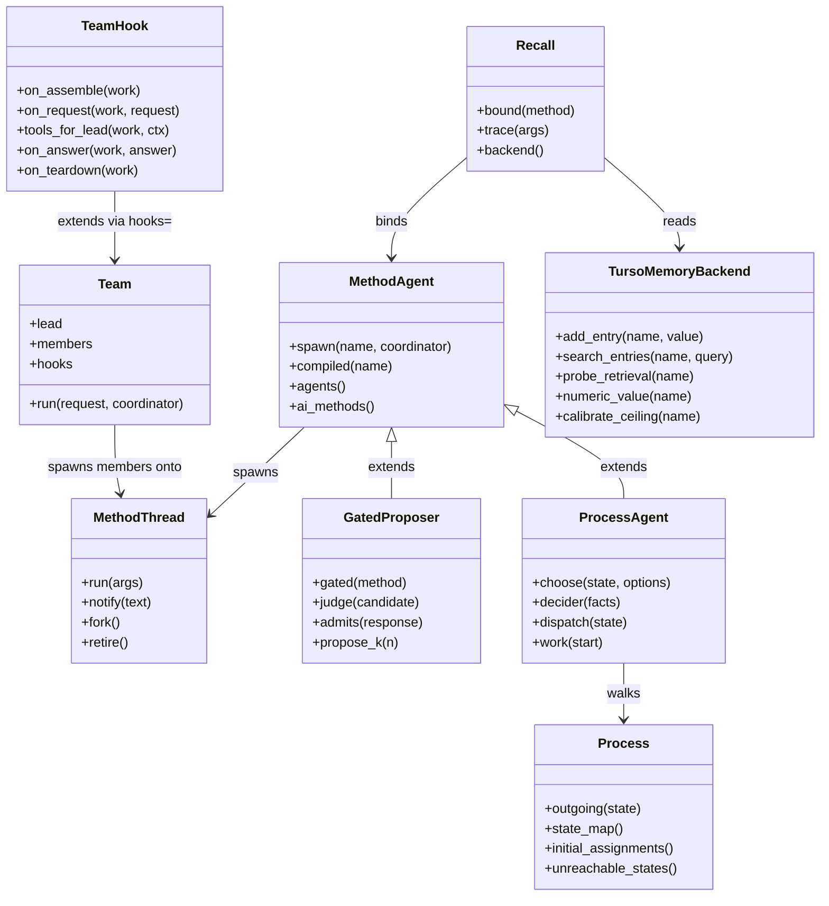

# pneuma · Components

```mermaid
classDiagram
    class MethodAgent {
        +spawn(name, coordinator)
        +compiled(name)
        +agents()
        +ai_methods()
    }
    class MethodThread {
        +run(args)
        +notify(text)
        +fork()
        +retire()
    }
    class GatedProposer {
        +gated(method)
        +judge(candidate)
        +admits(response)
        +propose_k(n)
    }
    class Recall {
        +bound(method)
        +trace(args)
        +backend()
    }
    class ProcessAgent {
        +choose(state, options)
        +decider(facts)
        +dispatch(state)
        +work(start)
    }
    class Team {
        +run(request, coordinator)
        +lead
        +members
        +hooks
    }
    class TeamHook {
        +on_assemble(work)
        +on_request(work, request)
        +tools_for_lead(work, ctx)
        +on_answer(work, answer)
        +on_teardown(work)
    }
    class Process {
        +outgoing(state)
        +state_map()
        +initial_assignments()
        +unreachable_states()
    }
    class TursoMemoryBackend {
        +add_entry(name, value)
        +search_entries(name, query)
        +probe_retrieval(name)
        +numeric_value(name)
        +calibrate_ceiling(name)
    }

    MethodAgent <|-- GatedProposer : extends
    MethodAgent <|-- ProcessAgent : extends
    MethodAgent --> MethodThread : spawns
    Recall --> MethodAgent : binds
    Recall --> TursoMemoryBackend : reads
    Team --> MethodThread : spawns members onto
    TeamHook --> Team : extends via hooks=
    ProcessAgent --> Process : walks
```
