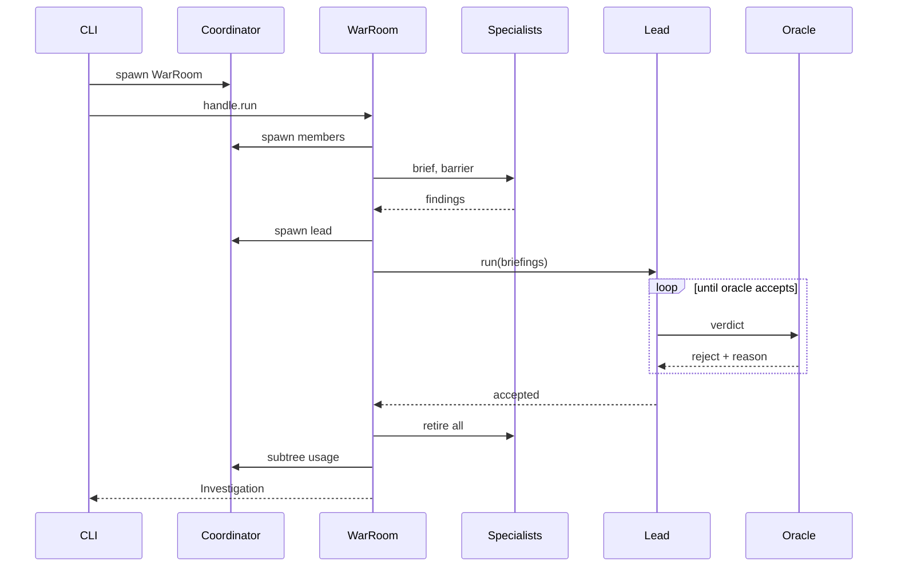
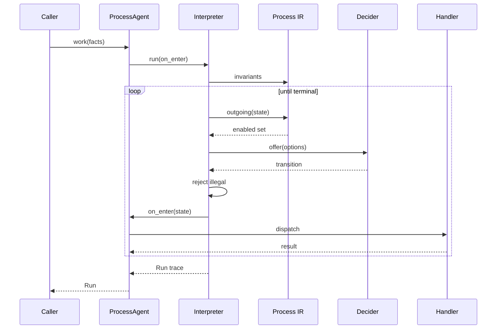
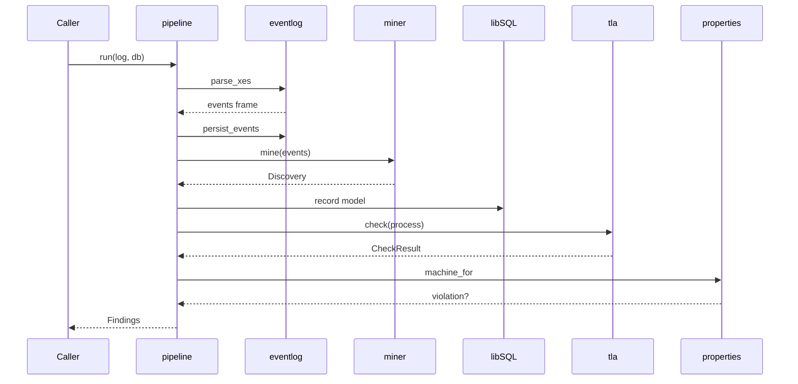

# pneuma · Sequences

Three processes, diagrams only. Each participant is a module or class read from source; the citation list under each diagram maps every lifeline and message to its `path:LOC`.

## War-room investigation

- Entry point `main` at `src/pneuma/demo/cli.py:117`; the async body `investigate` at `src/pneuma/demo/cli.py:26`.
- `CLI` — `src/pneuma/demo/cli.py:1`. `Coordinator` — `InMemoryCoordinator` constructed at `src/pneuma/demo/cli.py:42`, `LocalWorker` registered at `src/pneuma/demo/cli.py:43`.
- `WarRoom` — `src/pneuma/demo/warroom.py:83`. `Specialists` — one `Specialist` per plane, `src/pneuma/demo/warroom.py:99-101`, class at `src/pneuma/demo/cast.py:69`. `Lead` — `IncidentLead` at `src/pneuma/demo/cast.py:204`, composed at `src/pneuma/demo/warroom.py:125-126`. `Oracle` — `WarRoom.oracle` at `src/pneuma/demo/warroom.py:128`.
- `spawn WarRoom` — `src/pneuma/demo/cli.py:46-47`. `handle.run` — `src/pneuma/demo/cli.py:53`, forwarded through `WarRoom.execute` at `src/pneuma/demo/warroom.py:184`.
- `spawn members` — `Team.assemble` spawns serially at `src/pneuma/team.py:1232-1233`, called at `src/pneuma/team.py:1173`.
- `brief, barrier` and `findings` — `asyncio.gather` over each member's `ask` with `return_exceptions=True` at `src/pneuma/team.py:1265-1268`; re-keyed by plane at `src/pneuma/demo/warroom.py:201-204`.
- `spawn lead` and `run(briefings)` — `src/pneuma/team.py:1177-1187`.
- `verdict` / `reject + reason` — the oracle is prepended as a post-condition at `src/pneuma/team.py:1424`; failures return to the model as assertion text, `src/pneuma/demo/warroom.py:135-158`.
- `retire all` — unconditional `finally` covering members, hires and the lead, `src/pneuma/team.py:1194-1199`.
- `subtree usage` — `subtree_usage(..., since_id=baseline)` at `src/pneuma/team.py:1202`, baseline captured at `src/pneuma/team.py:1154`.
- `Investigation` — `run_type()` at `src/pneuma/demo/warroom.py:172-173`, built at `src/pneuma/team.py:1205-1217`, persisted at `src/pneuma/demo/cli.py:56`.

## Verified-process walk

- Entry point `ProcessAgent.work` at `src/pneuma/process/agent.py:267`.
- `ProcessAgent` — `src/pneuma/process/agent.py:83`. `Interpreter` — `src/pneuma/process/interpreter.py:176`. `Process IR` — `src/pneuma/process/ir.py`, imported at `src/pneuma/process/interpreter.py:24`. `Decider` — the `choose` `@ai_method` at `src/pneuma/process/agent.py:122`, adapted at `src/pneuma/process/agent.py:137-157`. `Handler` — the per-state `@ai_method` resolved by `handler_for` at `src/pneuma/process/agent.py:161`.
- `work(facts)` runs the wiring guard first — `src/pneuma/process/agent.py:314`, guard body at `src/pneuma/process/agent.py:357-368`.
- `run(on_enter)` — `src/pneuma/process/agent.py:322-330`.
- `invariants` — `_assert_invariants` at `src/pneuma/process/interpreter.py:241` and again per step at `:295`; body at `src/pneuma/process/interpreter.py:354-357`.
- `outgoing(state)` / `enabled set` — `src/pneuma/process/interpreter.py:256`; an empty set raises `Deadlock` at `:258`.
- `offer(options)` / `transition` — `_elicit` at `src/pneuma/process/interpreter.py:325-351`; a lone enabled transition skips the decider at `:338-339`; the decider renders `interpreter.offer` at `src/pneuma/process/agent.py:154`.
- `reject illegal` — proposals outside `legal` are appended to `rejected` and re-asked up to `max_rejections`, `src/pneuma/process/interpreter.py:343-351`.
- `on_enter(state)` — called once per visit at `src/pneuma/process/interpreter.py:248-249` and `:306-307`; the closure is installed at `src/pneuma/process/agent.py:319-320`.
- `dispatch` / `result` — `src/pneuma/process/agent.py:222`, model call at `:251`, `on_result` at `:257-258`, faults re-raised as `HandlerFailed` at `:253`.
- `Run trace` — returned on reaching a terminal state, `src/pneuma/process/interpreter.py:252-254` and `:315-317`; `Run` defined at `src/pneuma/process/interpreter.py:157`.

## Case-study pipeline

- Entry point `pipeline.run` at `src/pneuma/casestudy/pipeline.py:120`.
- `pipeline` — `src/pneuma/casestudy/pipeline.py:1`. `eventlog` — `src/pneuma/casestudy/eventlog.py`, imported at `src/pneuma/casestudy/pipeline.py:29`. `miner` — `src/pneuma/casestudy/miner.py`, same import. `libSQL` — the `libsql.Connection` returned by `eventlog.connect` at `src/pneuma/casestudy/eventlog.py:194`. `tla` and `properties` — `src/pneuma/process/tla.py` and `src/pneuma/process/properties.py`, imported at `src/pneuma/casestudy/pipeline.py:27`.
- `parse_xes` / `events frame` — `src/pneuma/casestudy/pipeline.py:129`, function at `src/pneuma/casestudy/eventlog.py:43`.
- `persist_events` — `src/pneuma/casestudy/pipeline.py:131-133`, function at `src/pneuma/casestudy/eventlog.py:213`.
- `mine(events)` / `Discovery` — `src/pneuma/casestudy/pipeline.py:135-140`, function at `src/pneuma/casestudy/miner.py:84`, dataclass at `src/pneuma/casestudy/miner.py:28`.
- `record model` — `src/pneuma/casestudy/pipeline.py:141`, INSERT at `src/pneuma/casestudy/pipeline.py:238-249`.
- `check(process)` / `CheckResult` — called twice, once for the mined model and once for the `governed` copy, at `src/pneuma/casestudy/pipeline.py:159-163`; `governed` attaches `NoDetermineWithoutCheck` at `src/pneuma/casestudy/pipeline.py:88-96`; `tla.check` shells out to TLC at `src/pneuma/process/tla.py:309-328`, gated on `tlc_available` at `src/pneuma/process/tla.py:265`.
- `machine_for` / `violation?` — `src/pneuma/casestudy/pipeline.py:165`, `_property_test` at `src/pneuma/casestudy/pipeline.py:179-197`, machine built at `src/pneuma/process/properties.py:72`.
- `Findings` — dataclass at `src/pneuma/casestudy/pipeline.py:36`, returned at `src/pneuma/casestudy/pipeline.py:176`. Step 6 of the study is a separate async entry, `execute_case` at `src/pneuma/casestudy/pipeline.py:200`.

## See also

- [Module map][module-map] — 11 shared source files
- [Processes][processes] — 11 shared source files
- [Impact analysis][impact-analysis] — 10 shared source files
- [Data flow][data-flow] — 9 shared source files
- [Contract map][contract-map] — 9 shared source files

[module-map]: ../../architecture/module-map.md
[processes]: ../../behavior/processes.md
[impact-analysis]: ../../insights/impact-analysis.md
[data-flow]: ../../architecture/data-flow.md
[contract-map]: ../../insights/contract-map.md
