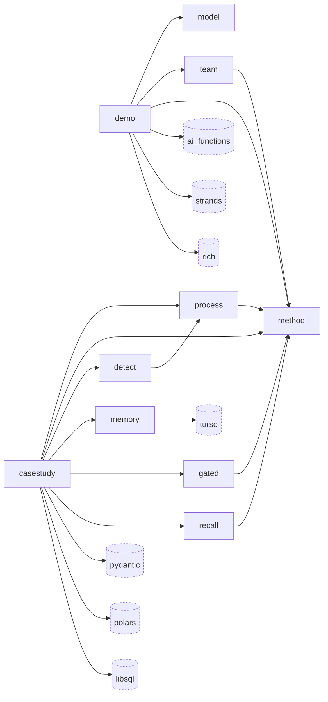

# pneuma · Dependency graph

`pneuma`'s ten internal modules and the seven external packages they import. Internal nodes are plain rectangles; external nodes are dashed and rounded.

## Internal modules

All ten live under the single distributed package `src/pneuma`, declared as the wheel's only package at `pyproject.toml:37-38`. Five are subpackages — `casestudy`, `demo`, `detect`, `memory`, `process` — and five are single-file modules: `gated.py`, `method.py`, `model.py`, `recall.py`, `team.py`.

The ten split into two declared layers, hand-maintained as a tested boundary rather than inferred: `LIBRARY = {"detect", "gated", "memory", "method", "model", "process", "recall", "team"}` and `APPLICATION = {"casestudy", "demo"}` (`tests/library/test_boundary.py:46-47`). That matches the graph — the two application modules are exactly the two roots nothing imports. The same file declares three packages as application-only, `{"polars", "libsql", "pm4py"}`, so that a library module importing one is a boundary violation (`tests/library/test_boundary.py:49-50`); both `polars` and `libsql` are sourced at `casestudy` in the diagram, consistent with that rule.

`method` is the most-depended-on module, with six inbound internal edges: from `casestudy` (`src/pneuma/casestudy/aimine.py:42`), `demo` (`src/pneuma/demo/typed_cast.py:30`), `gated` (`src/pneuma/gated.py:51`), `process` (`src/pneuma/process/agent.py:57`), `recall` (`src/pneuma/recall.py:60`), and `team` (`src/pneuma/team.py:55`). Every one of those imports `MethodAgent`.

`casestudy` and `demo` are the graph's two roots — no internal module imports either. `casestudy` reaches six other internal modules: `process` (`src/pneuma/casestudy/aimine.py:43`), `method`, `detect` (`src/pneuma/casestudy/harnesslearn.py:56`), `memory` (`src/pneuma/casestudy/harnesslearn.py:68`), `gated` (`src/pneuma/casestudy/harnesslearn.py:67`), and `recall` (`src/pneuma/casestudy/learning.py:61`). `demo` reaches three: `model` (`src/pneuma/demo/agent.py:33`), `team` (`src/pneuma/demo/staffing.py:27`), and `method`.

The remaining internal edge is `detect` → `process`, at `src/pneuma/detect/adapter.py:26`. The internal graph is sparse and acyclic.

## External dependencies

Seven direct runtime dependencies are declared at `pyproject.toml:6-14`. Each appears in the diagram sourced at the internal module whose files import it most often.

| Node | Distribution | Constraint | Importing files in `src/` | Sourced at |
|---|---|---|---|---|
| `ai_functions` | `strands-ai-functions` | git rev `e47dc94` (`pyproject.toml:18-19`) | 15 | `demo` — `src/pneuma/demo/agent.py:26` |
| `pydantic` | `pydantic` | `>=2.4.0` (`pyproject.toml:9`) | 13 | `casestudy` — `src/pneuma/casestudy/aimine.py:40` |
| `polars` | `polars` | `>=1.43.1` (`pyproject.toml:11`) | 9 | `casestudy` — `src/pneuma/casestudy/aimine.py:39` |
| `strands` | `strands-agents` | `>=1.50.0` (`pyproject.toml:8`) | 6 | `demo` — `src/pneuma/demo/agent.py:30` |
| `rich` | `rich` | `>=13.7` (`pyproject.toml:10`) | 2 | `demo` — `src/pneuma/demo/cli.py:12` |
| `turso` | `pyturso` | `>=0.7.2` (`pyproject.toml:13`) | 2 | `memory` — `src/pneuma/memory/turso_backend.py:50` |
| `libsql` | `libsql` | `>=0.1.11` (`pyproject.toml:12`) | 1 | `casestudy` — `src/pneuma/casestudy/eventlog.py:20` |

Three distributions install under a different name than they are declared: `strands-ai-functions` provides `ai_functions`, `strands-agents` provides `strands`, and `pyturso` provides `turso`. The diagram uses import names.

`strands-ai-functions` is the only dependency not resolved from PyPI. It is pinned to a git commit because PyPI 0.3.0 predates the `runtime/usage.py` helpers the project depends on (`pyproject.toml:16-19`); `uv.lock` resolves it to `0.3.1.dev5+ge47dc94e7`.

### Databases and services

Two of the seven external nodes are database drivers, and they open two different stores:

- `libsql.connect` at `src/pneuma/casestudy/eventlog.py:200` persists the XES event log to a libSQL file in WAL mode, so mining can read the log while the interpreter writes run traces to the same database (`src/pneuma/casestudy/eventlog.py:1-12`).
- `turso.connect` at `src/pneuma/memory/turso_backend.py:1343` opens the Turso-backed memory store, which holds addressable memory entries and vector recall (`src/pneuma/memory/turso_backend.py:1-10`).

One external service is reached, and it is not a declared dependency: Amazon Bedrock. `src/pneuma/memory/embedding.py:177` builds a `boto3.client("bedrock-runtime", ...)` to call Cohere Embed v4 (`src/pneuma/memory/embedding.py:146`), with defaults `global.cohere.embed-v4:0` in `us-east-1` at 1536 dimensions (`src/pneuma/memory/embedding.py:44-47`). `boto3` reaches the environment transitively through `strands-agents`, whose lock entry lists it as a dependency; `pneuma` never declares it. The client is built lazily so importing the module does not require credentials (`src/pneuma/memory/embedding.py:148`). Bedrock is also reached through `strands` directly, via `BedrockModel` at `src/pneuma/model.py:7`.

### Dependencies not drawn

Three import roots appear in `src/` but are not diagram nodes, because they are not direct runtime dependencies:

- `pm4py` — dev group (`pyproject.toml:27`). Imported inside functions at `src/pneuma/casestudy/benchmark.py:51` and `src/pneuma/casestudy/ir_petri.py:26-27`, deliberately kept off the runtime path because it is dev-only and AGPL (`src/pneuma/casestudy/benchmark.py:46-50`).
- `hypothesis` — dev group (`pyproject.toml:26`). Imported at module top level in shipped source at `src/pneuma/process/properties.py:29-30`, so importing that module fails without the dev group installed; also imported function-locally at `src/pneuma/casestudy/pipeline.py:181-182`.
- `boto3` — undeclared, transitive via `strands-agents`. Covered under Databases and services above.

The remaining dev-group entries — `pytest`, `pytest-asyncio`, `ruff` (`pyproject.toml:28-30`) — are build and test tooling with no `src/` imports.

## See also

- [Impact analysis][impact-analysis] — 20 shared source files
- [Module map][module-map] — 19 shared source files
- [Processes][processes] — 16 shared source files
- [Contract map][contract-map] — 16 shared source files
- [Business logic][business-logic] — 14 shared source files

[impact-analysis]: ../../insights/impact-analysis.md
[module-map]: ../../architecture/module-map.md
[processes]: ../../behavior/processes.md
[contract-map]: ../../insights/contract-map.md
[business-logic]: ../../insights/business-logic.md
