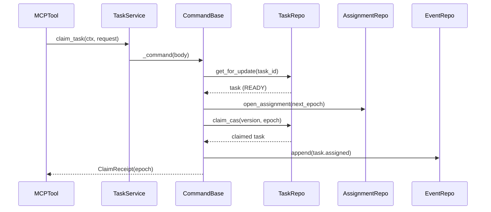
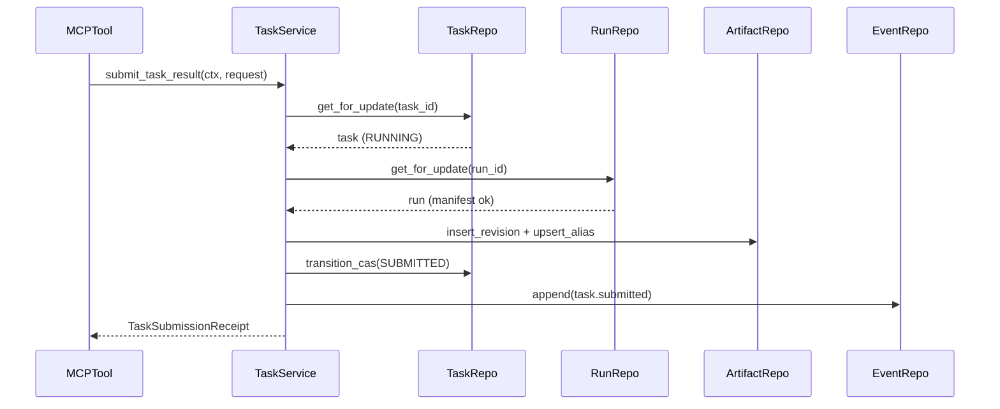
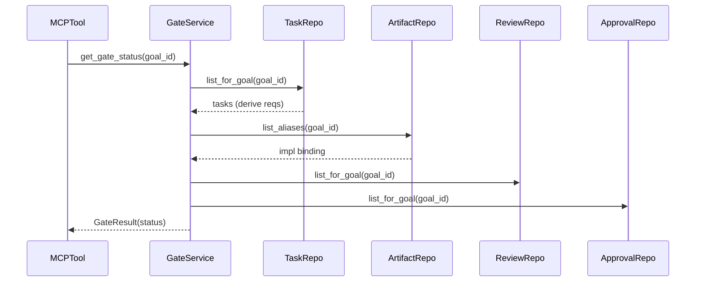

# omnigent-blackboard-poc · Data flow

This kernel is a transactional organizational blackboard driven by two adapters: a FastMCP server that exposes atomic command + read tools to agents (`src/sdlc_blackboard/interfaces/mcp/server.py:59`) and a Typer CLI for operators (`src/sdlc_blackboard/interfaces/cli.py:20`). The three flows below trace the task lifecycle a reader asks for end-to-end: claim a ready task, submit its result, then evaluate the release gate. Each command tool is a thin delegate that resolves the `Services` facade from the lifespan context and calls one application method (`src/sdlc_blackboard/interfaces/mcp/server.py:53`); every mutation runs inside one unit-of-work transaction wrapped by an idempotency envelope (`src/sdlc_blackboard/application/use_cases/base.py:55`).

## Flow 1: claim_task

1. The MCP `claim_task` tool delegates to the task service with the command context and request (`src/sdlc_blackboard/interfaces/mcp/tools_commands.py:73`).
2. `TaskService.claim_task` defines the transactional body and hands it to the shared command runner (`src/sdlc_blackboard/application/use_cases/task_service.py:109`).
3. The command base opens the unit-of-work transaction and executes the body idempotently by `command_id` (`src/sdlc_blackboard/application/use_cases/base.py:54`).
4. Inside the body, the task is row-locked and rejected unless it is in state `READY` (`src/sdlc_blackboard/application/use_cases/task_service.py:113`).
5. A new assignment is opened at the next fencing epoch; the partial unique index is the DB-level defense against a double claim (`src/sdlc_blackboard/application/use_cases/task_service.py:120`).
6. The task is claimed via compare-and-set on its version; a lost race raises `StaleVersion` (`src/sdlc_blackboard/application/use_cases/task_service.py:123`).
7. A `task.assigned` domain event and its outbox row are appended in the same transaction (`src/sdlc_blackboard/application/use_cases/task_service.py:128`).
8. A `ClaimReceipt` carrying the task and the fencing epoch is returned for later worker mutations (`src/sdlc_blackboard/application/use_cases/task_service.py:129`).

## Flow 2: submit_task_result

1. The MCP `submit_task_result` tool delegates to the task service with the command context and submission request (`src/sdlc_blackboard/interfaces/mcp/tools_commands.py:101`).
2. `TaskService.submit_task_result` locks the task and validates epoch, actor, and that state is `RUNNING` or `AWAITING_INPUT` (`src/sdlc_blackboard/application/use_cases/task_service.py:210`).
3. The active run is loaded and its input manifest is checked against the request, raising `InputManifestMismatch` on drift (`src/sdlc_blackboard/application/use_cases/task_service.py:217`).
4. Each submitted artifact is inserted as an immutable revision (deduped by content hash) with its alias upserted (`src/sdlc_blackboard/application/use_cases/task_service.py:247`).
5. The run is marked `SUBMITTED` and the assignment is completed (`src/sdlc_blackboard/application/use_cases/task_service.py:282`).
6. The task transitions to `SUBMITTED` via compare-and-set through the legal transition matrix (`src/sdlc_blackboard/application/use_cases/task_service.py:287`).
7. One review task per review requirement is created or re-opened for the new revision (`src/sdlc_blackboard/application/use_cases/task_service.py:294`).
8. A `TaskSubmissionReceipt` with the task, artifact revisions, and review task ids is returned (`src/sdlc_blackboard/application/use_cases/task_service.py:295`).

## Flow 3: get_gate_status

1. The MCP `get_gate_status` read tool delegates to the gate service for a goal (`src/sdlc_blackboard/interfaces/mcp/tools_read.py:59`).
2. `GateService.get_gate_status` opens a read unit-of-work and evaluates the gate on that connection (`src/sdlc_blackboard/application/use_cases/gate_service.py:47`).
3. Required review types are derived as the union of blocking review requirements across task contracts, falling back to quality and security (`src/sdlc_blackboard/application/use_cases/gate_service.py:67`).
4. The implementation artifact binding is resolved from the goal's current aliases (`src/sdlc_blackboard/application/use_cases/gate_service.py:71`).
5. Open blocking findings, reviews, and approvals for the goal are loaded (`src/sdlc_blackboard/application/use_cases/gate_service.py:73`).
6. Reviews are matched to the current binding fingerprint; stale ones are flagged and only non-stale approved reviews satisfy a required type (`src/sdlc_blackboard/application/use_cases/gate_service.py:92`).
7. A non-revoked human release approval bound to the current binding is required for the gate to pass (`src/sdlc_blackboard/application/use_cases/gate_service.py:108`).
8. The derived `GateResult` (SATISFIED, HUMAN_REQUIRED, or UNSATISFIED) with missing reviews, blocking findings, and missing approvals is returned (`src/sdlc_blackboard/application/use_cases/gate_service.py:124`).

## See also

- [processes](../behavior/processes.md) — 7 shared source citations
- [contract-map](../insights/contract-map.md) — 7 shared source citations
- [impact-analysis](../insights/impact-analysis.md) — 7 shared source citations
- [debugging-guide](../insights/debugging-guide.md) — 6 shared source citations
- [module-map](../architecture/module-map.md) — 5 shared source citations
