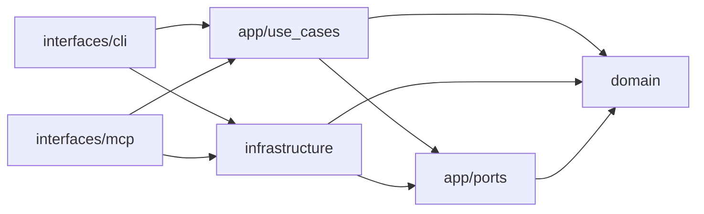

# omnigent-blackboard-poc · System overview

`omnigent-blackboard-poc` is a locally runnable "Agentic SDLC Team Runtime": a transactional PostgreSQL **blackboard kernel** that owns authoritative organizational state, exposed through a **thin FastMCP adapter**, and driven by an **Omnigent** team of specialist agents (`README.md:1`). The kernel is the source of truth for a software-delivery lifecycle — goals, tasks, artifacts, reviews, findings, release gates, and human approvals — while MCP merely exposes that kernel and does not define its semantics (`README.md:7`). It solves a specific problem: giving a fleet of autonomous agents a durable, concurrency-safe shared workspace whose rules (state transitions, review requirements, gate derivation) live in typed domain code rather than in prompts. The kernel is proven independently of any model by a scripted deterministic end-to-end test that drives the full goal-to-completion lifecycle with zero LLMs (`README.md:32`, `tests/e2e/test_scripted_flow.py`). Its consumers are the 17-context Omnigent team defined under `sdlc_team/` and, for development, a Typer CLI and the MCP surface itself (`README.md:109`).

The codebase is organized as a strict hexagonal architecture in four inward-pointing layers under `src/sdlc_blackboard/` (`README.md:14`). The **domain** layer is pure — Pydantic models, value objects, a state-transition matrix, the `ActorKind` context enumeration, and a total routing policy that maps all 18 `ActorKind`s to four cost-ordered `RoutingClass`es — importing no other layer (`src/sdlc_blackboard/domain/common.py:25`, `src/sdlc_blackboard/domain/routing.py:56`; 13 files). The **application** layer orchestrates use cases that return `CommandResult[T]` values and defines the port `Protocol`s adapters bind against; it imports domain heavily but never infrastructure (`src/sdlc_blackboard/application/ports.py:47`; 20 files). The **infrastructure** layer holds driven adapters: an asyncpg pool with a pool-wide jsonb codec, 12 repositories (split into an aggregate-per-module `repositories/` package, including an append-only command-failure ledger), a migrations runner, and the composition root `build_container` (`src/sdlc_blackboard/infrastructure/di.py:64`, `src/sdlc_blackboard/infrastructure/repositories/goals.py:36`; 15 files). The **interfaces** layer holds thin driving adapters that translate transport to use-case calls with no business logic (`src/sdlc_blackboard/interfaces/mcp/server.py:59`, `src/sdlc_blackboard/interfaces/cli.py:20`; 6 files).

Concretely, the two entry points a reader should open first are `interfaces/mcp/server.py`, which constructs the `FastMCP` server object and registers a `/health` route plus 13 command tools and 5 read tools (`src/sdlc_blackboard/interfaces/mcp/server.py:71`, `README.md:18`), and `interfaces/cli.py`, the `blackboard` developer CLI wired in `pyproject.toml` (`pyproject.toml:32`). A typical mutating request flows inward: a command tool in `interfaces/mcp/tools_commands.py` calls an application use case, which opens a unit-of-work transaction over the shared pool, executes pure domain logic, and returns a structured `CommandResult` — domain errors are raised inside the use case and caught once at the service edge so no raw exception ever crosses the command boundary (`README.md:148`). The release gate is data-driven: it derives its required review types from the blocking `ReviewRequirement`s declared across a goal's task contracts, so adding a governing context is a contract change, never a kernel change (`README.md:120`, `README.md:212`). Operators can read a goal's coordination-thrash report through a CLI-only `thrash` command, deliberately not exposed as an MCP tool so agents cannot observe and game their own thrash metric (`src/sdlc_blackboard/interfaces/cli.py:105`). Omnigent itself is deliberately not a dependency — the team talks to the kernel over HTTP and the runtime is pinned from PyPI via `uvx` (`README.md:40`, `mise.toml:88`).

## Stack

| Layer | Technology | Source |
|---|---|---|
| Language / runtime | Python 3.14 | `pyproject.toml:6` |
| MCP transport | FastMCP (`fastmcp>=3.4.4,<4`) | `pyproject.toml:8` |
| Domain modeling | Pydantic 2 + pydantic-settings | `pyproject.toml:9`, `pyproject.toml:10` |
| Storage | PostgreSQL via asyncpg driver; dbmate migrations | `pyproject.toml:11`, `mise.toml:8` |
| CLI | Typer | `pyproject.toml:14` |
| Structured logging | structlog + orjson | `pyproject.toml:12`, `pyproject.toml:13` |
| Formal model | Lean 4 (v4.32.0) + Lake | `formal/lean-toolchain:1`, `mise.toml:70` |
| Build backend | Hatchling | `pyproject.toml:36` |
| Test / lint tooling | pytest + hypothesis + testcontainers; ruff; pyright strict | `pyproject.toml:19`, `pyproject.toml:25`, `pyproject.toml:75` |

## Module map

## See also

- [impact-analysis](../insights/impact-analysis.md) — 7 shared source citations
- [contract-map](../insights/contract-map.md) — 6 shared source citations
- [module-map](../architecture/module-map.md) — 5 shared source citations
- [risk-hotspots](../analysis/risk-hotspots.md) — 4 shared source citations
- [processes](../behavior/processes.md) — 3 shared source citations
