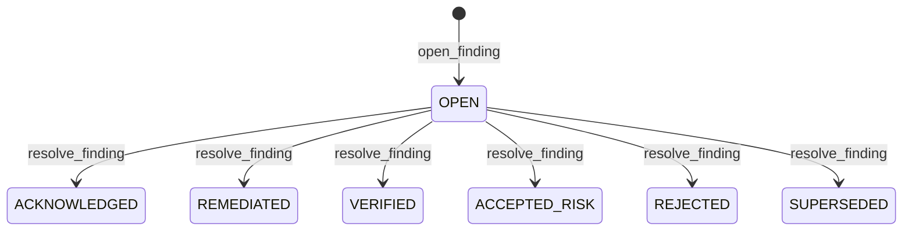
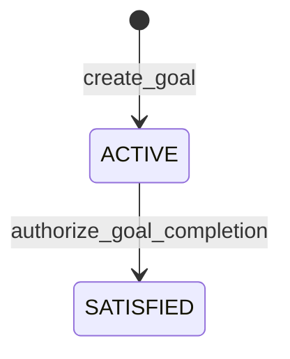
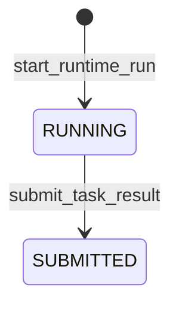
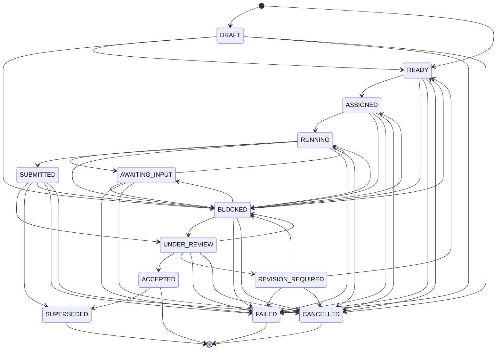

# omnigent-blackboard-poc · State machines

## FindingState

A finding is created in `OPEN` (`src/sdlc_blackboard/application/use_cases/review_service.py:63`). `resolve_finding` writes any target `FindingState` through the unconstrained `set_state_cas` (`src/sdlc_blackboard/application/use_cases/review_service.py:94-95`; request field typed `FindingState` at `src/sdlc_blackboard/application/commands.py:63-65`), so a transition from a non-`OPEN` source is also legal; the diagram shows the `OPEN` entry hub only. `VERIFIED`, `ACCEPTED_RISK`, `REJECTED`, and `SUPERSEDED` are the gate-resolved states (`RESOLVED_FINDING_STATES`, `src/sdlc_blackboard/domain/findings.py:42-49`); source enforces no state-machine terminal, so no `--> [*]` is drawn.
Defined at: `src/sdlc_blackboard/domain/findings.py:31-38`

## GoalState

A goal is created directly in `ACTIVE` (`src/sdlc_blackboard/application/use_cases/goal_service.py:35`); the only kernel transition moves `ACTIVE --> SATISFIED` via `authorize_goal_completion` (`src/sdlc_blackboard/application/use_cases/goal_service.py:81-82`). The enum also declares `DRAFT`, `BLOCKED`, `FAILED`, and `CANCELLED` (`src/sdlc_blackboard/domain/goals.py:13-19`), but no kernel transition site assigns them, so no edges to those states are drawn. Source declares no explicit terminal.
Defined at: `src/sdlc_blackboard/domain/goals.py:13-19`

## RunState

A runtime run is inserted in `RUNNING` (`src/sdlc_blackboard/application/use_cases/task_service.py:185`), then moved `RUNNING --> SUBMITTED` inside `submit_task_result` (`src/sdlc_blackboard/application/use_cases/task_service.py:282-283`). The enum also declares `CREATED`, `FAILED`, and `CANCELLED` (`src/sdlc_blackboard/domain/events.py:17-22`), but no kernel transition site assigns them, so no edges to those states are drawn. Source declares no explicit terminal.
Defined at: `src/sdlc_blackboard/domain/events.py:17-22`

## TaskState

A task is created in `DRAFT` when it has dependencies, else `READY` (`src/sdlc_blackboard/application/use_cases/task_service.py:79`). The explicit `(from -> to)` edges come from `_EXPLICIT_EDGES` (`src/sdlc_blackboard/domain/transitions.py:15-37`); every non-terminal state additionally transitions to `BLOCKED`, `FAILED`, or `CANCELLED` via the universal rule (`src/sdlc_blackboard/domain/transitions.py:39-42,45-58`). `ACCEPTED`, `FAILED`, `CANCELLED`, and `SUPERSEDED` are terminal (`TERMINAL_TASK_STATES`, `src/sdlc_blackboard/domain/tasks.py:35-37`). Self-loops are disallowed (`src/sdlc_blackboard/domain/transitions.py:54-55`). Edges carry no labels because `transitions.py` defines them as pure state pairs; transition triggers are scattered across `transition_cas` call sites in `task_service.py` (e.g. `:195`, `:287`, `:328`, `:340`, `:370`).
Defined at: `src/sdlc_blackboard/domain/transitions.py:15-58`

## See also

- [impact-analysis](../insights/impact-analysis.md) — 9 shared source citations
- [contract-map](../insights/contract-map.md) — 8 shared source citations
- [business-logic](../insights/business-logic.md) — 6 shared source citations
- [public-api](../reference/public-api.md) — 5 shared source citations
- [processes](../behavior/processes.md) — 3 shared source citations
