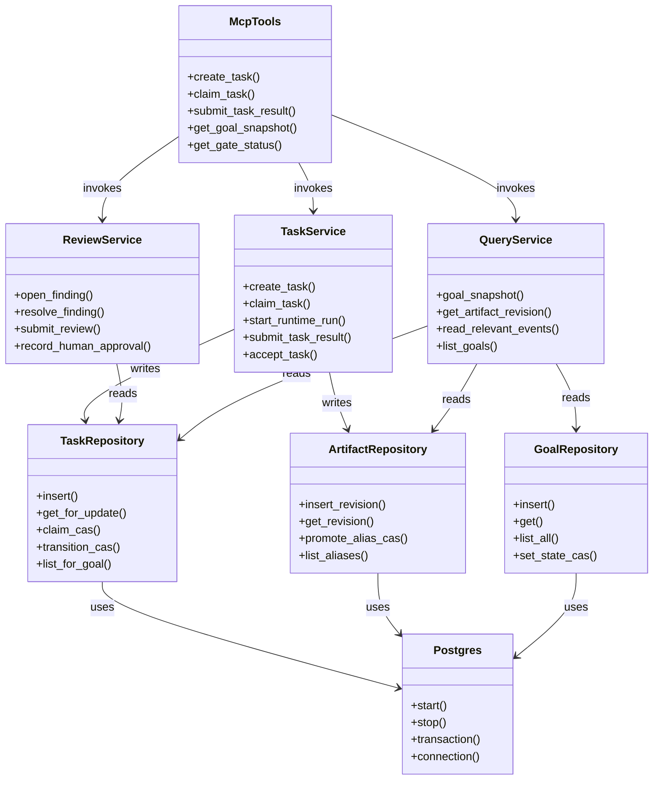

# omnigent-blackboard-poc · Components

```mermaid
classDiagram
    class McpTools {
        +create_task()
        +claim_task()
        +submit_task_result()
        +get_goal_snapshot()
        +get_gate_status()
    }
    class TaskService {
        +create_task()
        +claim_task()
        +start_runtime_run()
        +submit_task_result()
        +accept_task()
    }
    class ReviewService {
        +open_finding()
        +resolve_finding()
        +submit_review()
        +record_human_approval()
    }
    class QueryService {
        +goal_snapshot()
        +get_artifact_revision()
        +read_relevant_events()
        +list_goals()
    }
    class TaskRepository {
        +insert()
        +get_for_update()
        +claim_cas()
        +transition_cas()
        +list_for_goal()
    }
    class ArtifactRepository {
        +insert_revision()
        +get_revision()
        +promote_alias_cas()
        +list_aliases()
    }
    class GoalRepository {
        +insert()
        +get()
        +list_all()
        +set_state_cas()
    }
    class Postgres {
        +start()
        +stop()
        +transaction()
        +connection()
    }

    McpTools --> TaskService : invokes
    McpTools --> ReviewService : invokes
    McpTools --> QueryService : invokes
    TaskService --> TaskRepository : writes
    TaskService --> ArtifactRepository : writes
    ReviewService --> TaskRepository : reads
    QueryService --> GoalRepository : reads
    QueryService --> TaskRepository : reads
    QueryService --> ArtifactRepository : reads
    TaskRepository --> Postgres : uses
    ArtifactRepository --> Postgres : uses
    GoalRepository --> Postgres : uses
```
