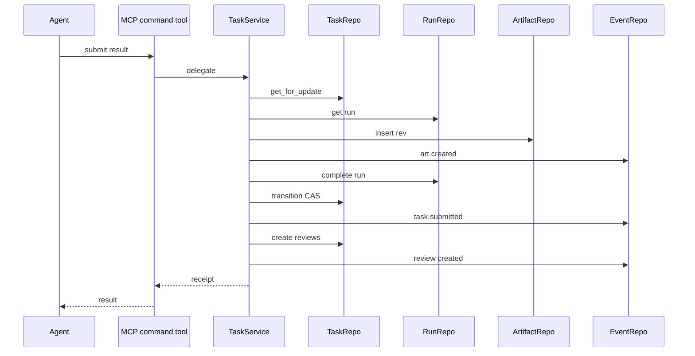
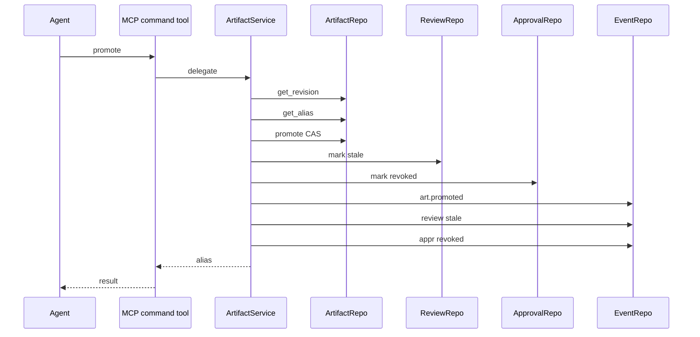
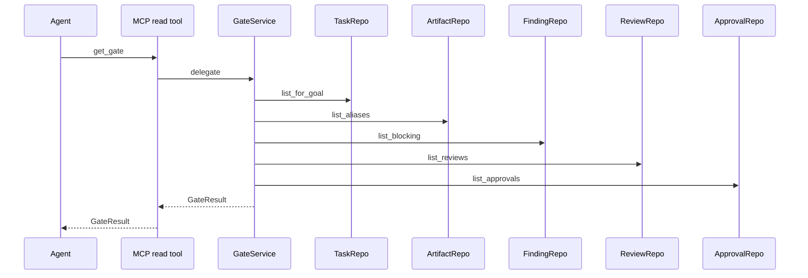

# omnigent-blackboard-poc · Sequences

## Task submission

```mermaid
sequenceDiagram
    participant Agent
    participant MCP as MCP command tool
    participant TaskService
    participant TaskRepo
    participant RunRepo
    participant ArtifactRepo
    participant EventRepo
    Agent->>MCP: submit result
    MCP->>TaskService: delegate
    TaskService->>TaskRepo: get_for_update
    TaskService->>RunRepo: get run
    TaskService->>ArtifactRepo: insert rev
    TaskService->>EventRepo: art.created
    TaskService->>RunRepo: complete run
    TaskService->>TaskRepo: transition CAS
    TaskService->>EventRepo: task.submitted
    TaskService->>TaskRepo: create reviews
    TaskService->>EventRepo: review created
    TaskService-->>MCP: receipt
    MCP-->>Agent: result
```

## Artifact promotion

```mermaid
sequenceDiagram
    participant Agent
    participant MCP as MCP command tool
    participant ArtifactService
    participant ArtifactRepo
    participant ReviewRepo
    participant ApprovalRepo
    participant EventRepo
    Agent->>MCP: promote
    MCP->>ArtifactService: delegate
    ArtifactService->>ArtifactRepo: get_revision
    ArtifactService->>ArtifactRepo: get_alias
    ArtifactService->>ArtifactRepo: promote CAS
    ArtifactService->>ReviewRepo: mark stale
    ArtifactService->>ApprovalRepo: mark revoked
    ArtifactService->>EventRepo: art.promoted
    ArtifactService->>EventRepo: review stale
    ArtifactService->>EventRepo: appr revoked
    ArtifactService-->>MCP: alias
    MCP-->>Agent: result
```

## Release-gate evaluation

```mermaid
sequenceDiagram
    participant Agent
    participant MCP as MCP read tool
    participant GateService
    participant TaskRepo
    participant ArtifactRepo
    participant FindingRepo
    participant ReviewRepo
    participant ApprovalRepo
    Agent->>MCP: get_gate
    MCP->>GateService: delegate
    GateService->>TaskRepo: list_for_goal
    GateService->>ArtifactRepo: list_aliases
    GateService->>FindingRepo: list_blocking
    GateService->>ReviewRepo: list_reviews
    GateService->>ApprovalRepo: list_approvals
    GateService-->>MCP: GateResult
    MCP-->>Agent: GateResult
```
