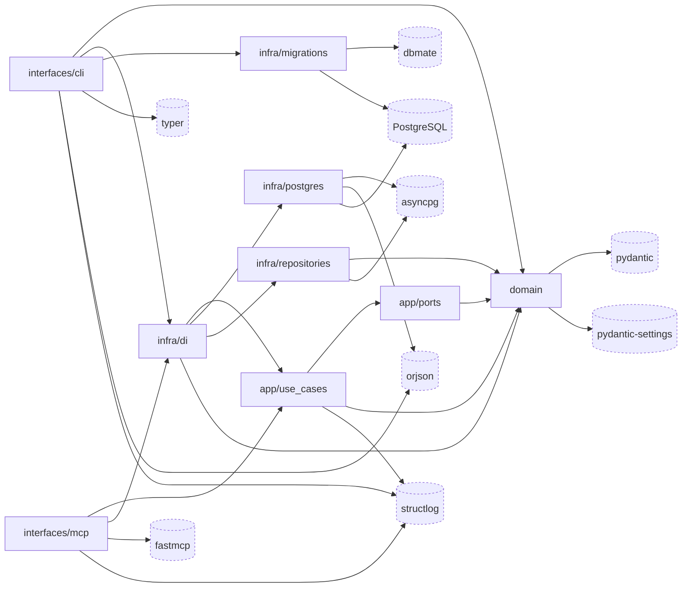

# omnigent-blackboard-poc · Dependency graph

Internal modules are the four hexagonal layers of `src/sdlc_blackboard/` — `domain/`, `application/`, `infrastructure/`, `interfaces/` — packaged as one wheel (`pyproject.toml:38-39`). External nodes are the direct runtime dependencies from `pyproject.toml:7-15` that are actually imported in `src/`, plus the Postgres database and the dbmate migration tool the infrastructure layer reaches out to.

All seven direct runtime dependencies declared in `pyproject.toml:7-15` are imported in `src/` and appear above: `fastmcp` (`src/sdlc_blackboard/interfaces/mcp/server.py:21`), `pydantic` / `pydantic-settings` (`src/sdlc_blackboard/domain/settings.py:11-12`), `asyncpg` (`src/sdlc_blackboard/infrastructure/postgres.py:15`), `structlog` (`src/sdlc_blackboard/infrastructure/logging.py:20`), `orjson` (`src/sdlc_blackboard/infrastructure/postgres.py:16`), `typer` (`src/sdlc_blackboard/interfaces/cli.py:13`). None are omitted. `starlette` (`src/sdlc_blackboard/interfaces/mcp/server.py:22-23`) rides in transitively via `fastmcp` and is not a declared dependency, so it carries no first-class node.

## See also

- [module-map](../../architecture/module-map.md) — 4 shared source citations
- [debugging-guide](../../insights/debugging-guide.md) — 4 shared source citations
- [system-overview](../../architecture/system-overview.md) — 3 shared source citations
- [data-flow](../../architecture/data-flow.md) — 2 shared source citations
- [processes](../../behavior/processes.md) — 2 shared source citations
